---
## Front matter
title: "Лабораторная работа №1"
subtitle: "Установка и конфигурация операционной системы на виртуальную машину"
author: "Беличева Дарья Михайловна"

## Generic otions
lang: ru-RU
toc-title: "Содержание"

## Bibliography
bibliography: bib/cite.bib
csl: pandoc/csl/gost-r-7-0-5-2008-numeric.csl

## Pdf output format
toc: true # Table of contents
toc-depth: 2
lof: true # List of figures
lot: false # List of tables
fontsize: 12pt
linestretch: 1.5
papersize: a4
documentclass: scrreprt
## I18n polyglossia
polyglossia-lang:
  name: russian
  options:
	- spelling=modern
	- babelshorthands=true
polyglossia-otherlangs:
  name: english
## I18n babel
babel-lang: russian
babel-otherlangs: english
## Fonts
mainfont: PT Serif
romanfont: PT Serif
sansfont: PT Sans
monofont: PT Mono
mainfontoptions: Ligatures=TeX
romanfontoptions: Ligatures=TeX
sansfontoptions: Ligatures=TeX,Scale=MatchLowercase
monofontoptions: Scale=MatchLowercase,Scale=0.9
## Biblatex
biblatex: true
biblio-style: "gost-numeric"
biblatexoptions:
  - parentracker=true
  - backend=biber
  - hyperref=auto
  - language=auto
  - autolang=other*
  - citestyle=gost-numeric
## Pandoc-crossref LaTeX customization
figureTitle: "Рис."
tableTitle: "Таблица"
listingTitle: "Листинг"
lofTitle: "Список иллюстраций"
lotTitle: "Список таблиц"
lolTitle: "Листинги"
## Misc options
indent: true
header-includes:
  - \usepackage{indentfirst}
  - \usepackage{float} # keep figures where there are in the text
  - \floatplacement{figure}{H} # keep figures where there are in the text
---

# Цель работы

Целью данной работы является приобретение практических навыков
установки операционной системы на виртуальную машину, настройки минимально необходимых для дальнейшей работы сервисов.

# Теоретическое введение

Rocky Linux — дистрибутив Linux, разработанный Rocky Enterprise Software Foundation.

Предполагается, что это будет полный бинарно-совместимый выпуск, использующий исходный код операционной системы Red Hat Enterprise Linux (RHEL). Цель проекта — предоставить корпоративную операционную систему производственного уровня, поддерживаемую сообществом. Rocky Linux, наряду с Red Hat Enterprise Linux и SUSE Linux Enterprise, стала популярной для использования в корпоративных операционных системах.

Первая версия-кандидат на выпуск Rocky Linux была выпущена 30 апреля 2021 г., а ее первая общедоступная версия была выпущена 21 июня 2021 г. Rocky Linux 8 будет поддерживаться до мая 2029 г. [@wiki].

# Выполнение лабораторной работы

Проверим в свойствах VirtualBox месторасположение каталога
для виртуальных машин. Для этого в VirtualBox выберем Файл ->
Настройки, вкладка Общие. В поле Папка для машин (рис. [-@fig:001]) укажем `C:\Users\dasha\VirtualBox VMs`.

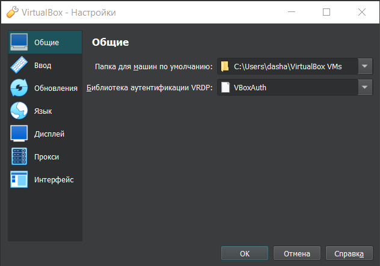{#fig:001 width=70%}

Создадим новую виртуальную машину. Для этого в VirtualBox выберем
Машина -> Создать; укажем имя виртуальной машины (dmbelicheva), тип
операционной системы -- Linux, RedHat; укажем размер основной памяти виртуальной машины -- 4096
МБ и поставим 2 процессора (чтоб не втыкали); зададим размер диска -- 40 ГБ  (рис. [-@fig:002]-[-@fig:005]).

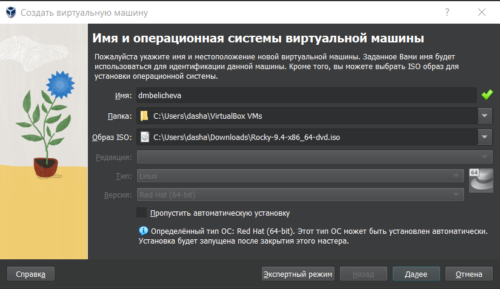{#fig:002 width=70%}

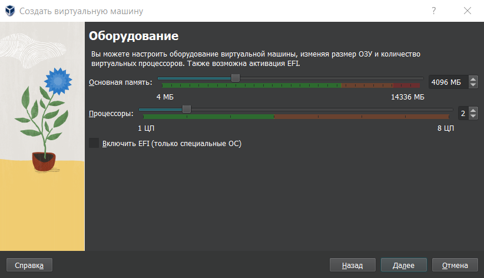{#fig:003 width=70%}

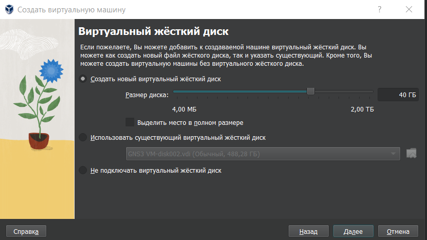{#fig:004 width=70%}

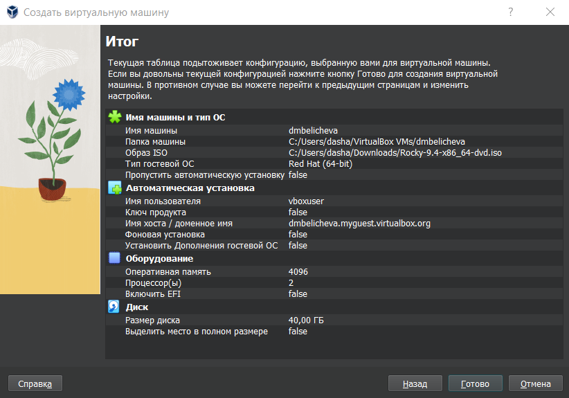{#fig:005 width=70%}

Выберем в VirtualBox для виртуальной машины Настройки ->
Носители. Добавим новый привод оптических дисков и выберем образ операционной системы (рис. [-@fig:006]).

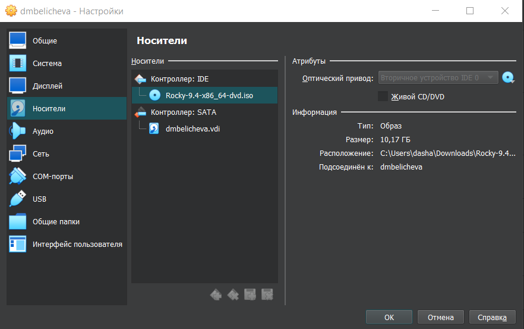{#fig:006 width=70%}

Запустим виртуальную машину, выберем English в качестве языка интерфейса (рис. [-@fig:007]) и перейдем к настройкам установки операционной
системы.
При необходимости скорректируем часовой пояс, раскладку клавиатуры
(добавим русский язык, но в качестве языка по умолчанию
укажем английский язык; зададим комбинацию клавиш для переключения
между раскладками клавиатуры -- `Alt + Shift`).
В разделе выбора программ укажем в качестве базового окружения
Server with GUI, а в качестве дополнения -- Development Tools (рис. [-@fig:008]).

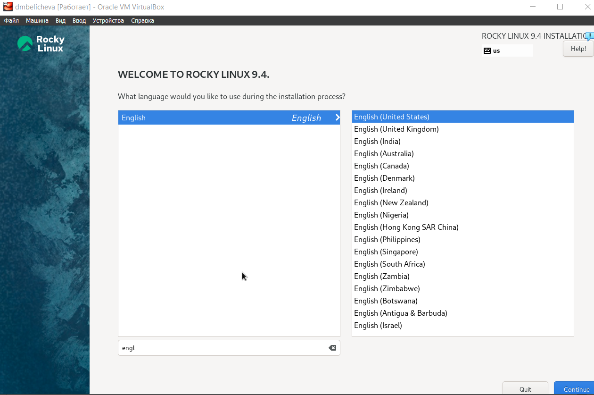{#fig:007 width=70%}

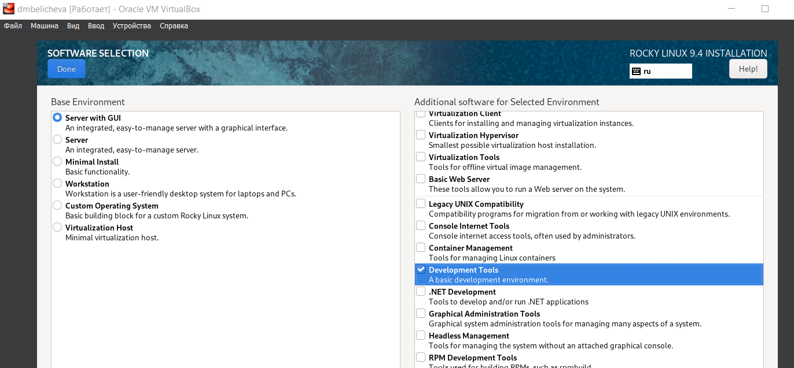{#fig:008 width=70%}

Отключим KDUMP (рис. [-@fig:009]).

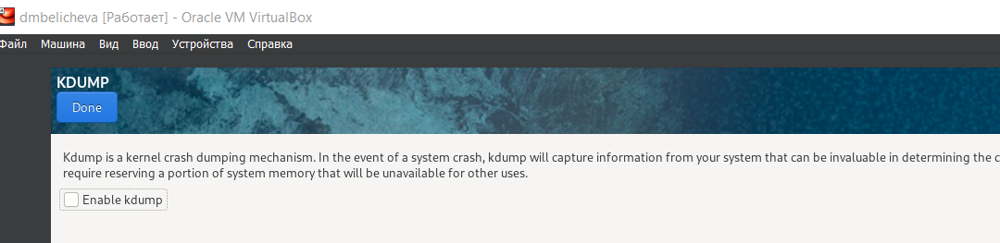{#fig:009 width=70%}

Место установки ОС оставим без изменения (рис. [-@fig:010]).

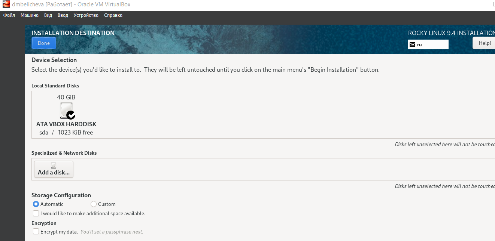{#fig:010 width=70%}

Включим сетевое соединение и в качестве имени узла укажем
dmbelicheva.localdomain (рис. [-@fig:011]).

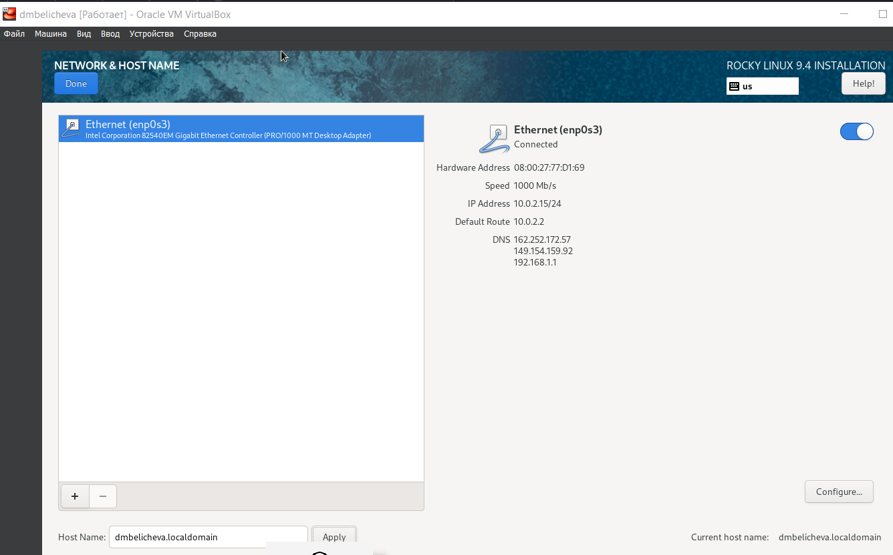{#fig:011 width=70%}

Установим пароль для root и пользователя с правами администратора (рис.  [-@fig:012]-[-@fig:013]).

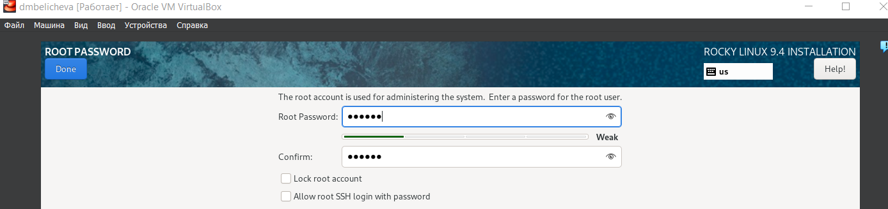{#fig:012 width=70%}

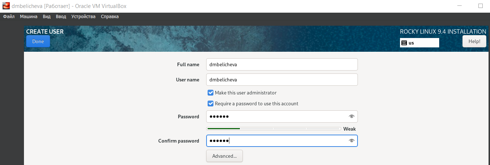{#fig:013 width=70%}

После завершения установки операционной системы корректно перезапустим виртуальную машину и примем условия лицензии, если потребуется.

Войдем в ОС под заданной при установке учётной записью. В меню Устройства виртуальной машины подключим образ диска дополнений гостевой ОС (рис. [-@fig:014]).
После загрузки дополнений нажмите Return или Enter и корректно перезагрузите виртуальную машину.

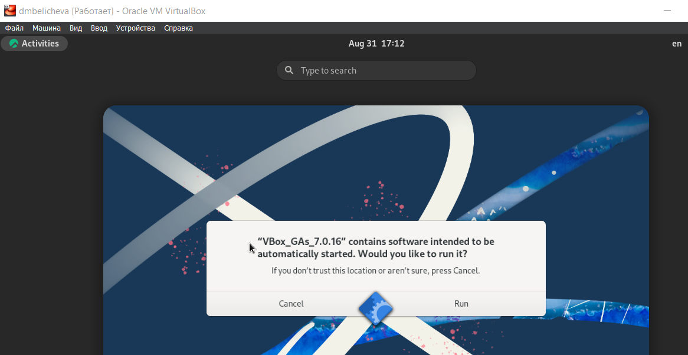{#fig:014 width=70%}

Проверим, что имя хоста установлено верно с помощью команды `hostnamectl` (рис. [-@fig:015]).

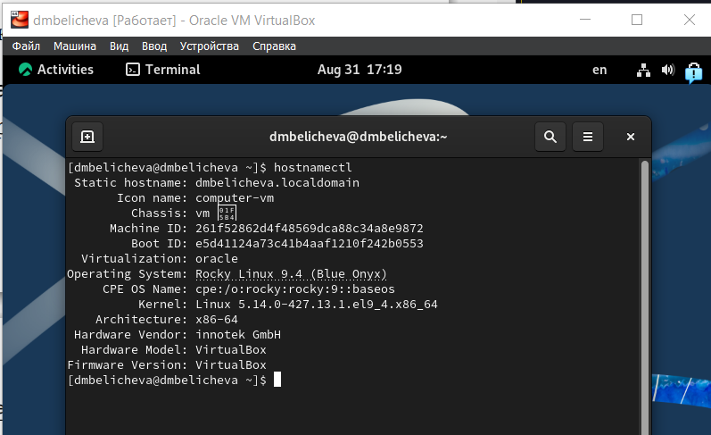{#fig:015 width=70%}

# Домашнее задание

Дождемся загрузки графического окружения и откроем терминал. В окне
терминала проанализируем последовательность загрузки системы, выполнив команду dmesg. Можно просто просмотреть вывод этой команды: `dmesg | less` (рис. [-@fig:016]).

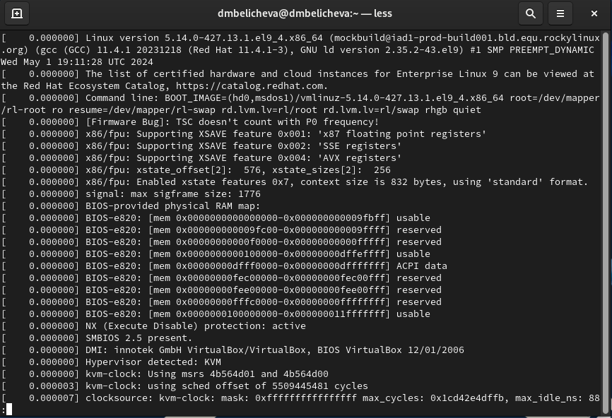{#fig:016 width=70%}

Можно использовать поиск с помощью grep:
dmesg | grep -i "то, что ищем"
Получите следующую информацию  (рис. [-@fig:017]).

1. Версия ядра Linux (Linux version).
2. Частота процессора (Detected Mhz processor).
3. Модель процессора (CPU0).
4. Объем доступной оперативной памяти (Memory available).
5. Тип обнаруженного гипервизора (Hypervisor detected).
6. Тип файловой системы корневого раздела.

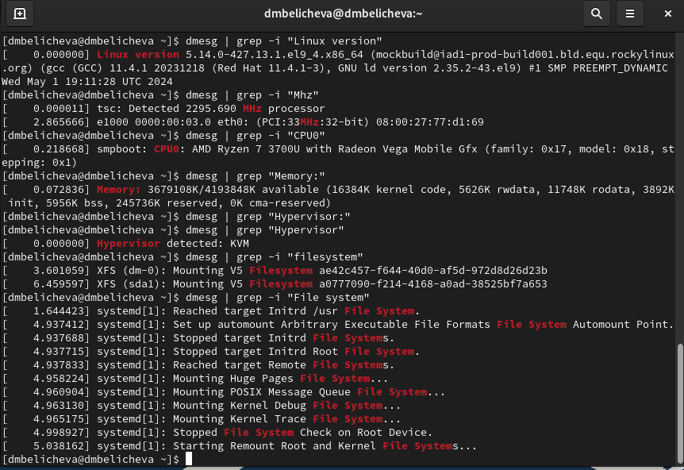{#fig:017 width=70%}

# Контрольные вопросы

1. Какую информацию содержит учётная запись пользователя?

Совокупность данных о пользователе, необходимая для его опознавания (аутентификации) и предоставления доступа к его личным данным и настройкам. 
Учётная запись, как правило, содержит сведения, необходимые для опознания пользователя при подключении к системе, сведения для авторизации и учёта. Это идентификатор пользователя (login) и его пароль. Пароль или его аналог, как правило, хранится в зашифрованном или хэшированном виде для обеспечения его безопасности.

2. Укажите команды терминала и приведите примеры:
  
- для получения справки по команде: команда `man`;
- для перемещения по файловой системе: команда `cd` ;
- для просмотра содержимого каталога: команда `ls`;
- для определения объёма каталога: команда `du`;
- для создания / удаления каталогов / файлов: команда `mkdir`/ команда `rm -r`/ команда `rm`;
- для задания определённых прав на файл / каталог: команда `chmod`;
- для просмотра истории команд: команда `history`.

3. Что такое файловая система? Приведите примеры с краткой характеристикой.

Файловая система — это метод управления файлами и папками на пользовательских устройствах хранения, таких как жёсткие диски, флеш-накопители и другие носители данных.

- FAT -- одна из самых старых файловых систем, разработанная для использования в операционных системах MS-DOS и Windows.

- NTFS -- файловая система, разработанная компанией Microsoft и используемая в операционных системах Windows NT и последующих версиях Windows.

- ext4 -- файловая система, используемая в операционных системах Linux.

4. Как посмотреть, какие файловые системы подмонтированы в ОС?

df (аббревиатура от disk free) — утилита в UNIX и UNIX-подобных системах.

Она показывает список всех файловых систем по именам устройств, сообщает их размер, занятое и свободное пространство и точки монтирования.

Утилиту df можно использовать для получения информации о том, к какой файловой системе относится какой-либо каталог.

5. Как удалить зависший процесс?

Чтобы удалить зависший процесс в Linux, можно использовать следующие команды:

Команда kill принимает в качестве параметра PID процесса и отправляет сигнал процессу. По умолчанию посылается сигнал SIGTERM.

Команда killall предназначена для «убийства» всех процессов, имеющих одно и то же имя.

# Выводы

В результате выполнения лабораторной работы я приобрела практические навыки
установки операционной системы на виртуальную машину, настройки минимально необходимых для дальнейшей работы сервисов.

# Список литературы{.unnumbered}

::: {#refs}
:::
