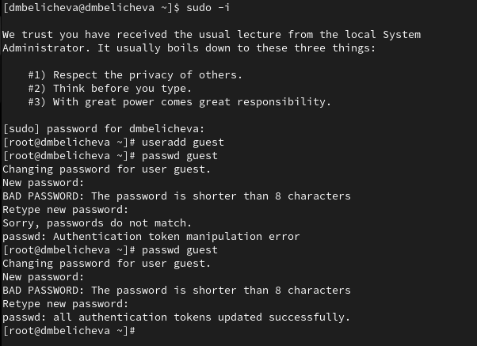
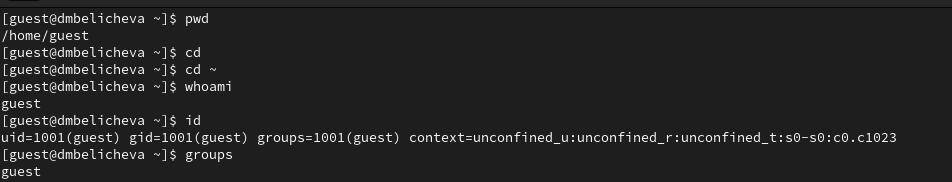
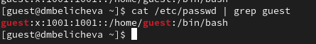
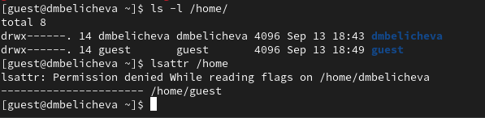
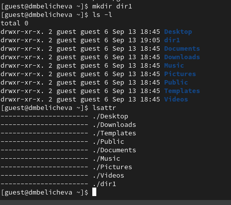
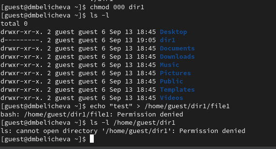
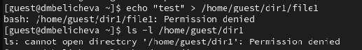
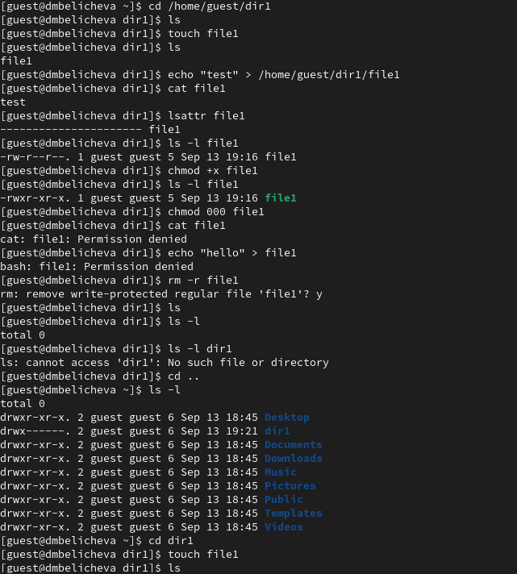

---
## Front matter
title: "Лабораторная работа № 2"
subtitle: "Дискреционное разграничение прав в Linux. Основные атрибуты"
author: "Беличева Дарья Михайловна"

## Generic otions
lang: ru-RU
toc-title: "Содержание"

## Bibliography
bibliography: bib/cite.bib
csl: pandoc/csl/gost-r-7-0-5-2008-numeric.csl

## Pdf output format
toc: true # Table of contents
toc-depth: 2
lof: true # List of figures
lot: true # List of tables
fontsize: 12pt
linestretch: 1.5
papersize: a4
documentclass: scrreprt
## I18n polyglossia
polyglossia-lang:
  name: russian
  options:
	- spelling=modern
	- babelshorthands=true
polyglossia-otherlangs:
  name: english
## I18n babel
babel-lang: russian
babel-otherlangs: english
## Fonts
mainfont: PT Serif
romanfont: PT Serif
sansfont: PT Sans
monofont: PT Mono
mainfontoptions: Ligatures=TeX
romanfontoptions: Ligatures=TeX
sansfontoptions: Ligatures=TeX,Scale=MatchLowercase
monofontoptions: Scale=MatchLowercase,Scale=0.9
## Biblatex
biblatex: true
biblio-style: "gost-numeric"
biblatexoptions:
  - parentracker=true
  - backend=biber
  - hyperref=auto
  - language=auto
  - autolang=other*
  - citestyle=gost-numeric
## Pandoc-crossref LaTeX customization
figureTitle: "Рис."
tableTitle: "Таблица"
listingTitle: "Листинг"
lofTitle: "Список иллюстраций"
lotTitle: "Список таблиц"
lolTitle: "Листинги"
## Misc options
indent: true
header-includes:
  - \usepackage{indentfirst}
  - \usepackage{float} # keep figures where there are in the text
  - \floatplacement{figure}{H} # keep figures where there are in the text
---

# Цель работы

Получение практических навыков работы в консоли с атрибутами файлов, закрепление теоретических основ дискреционного разграничения доступа в современных системах с открытым кодом на базе ОС Linux.

# Теоретическое введение

В Linux, как и в любой многопользовательской системе, абсолютно естественным образом возникает задача разграничения доступа субъектов — пользователей к объектам — файлам дерева каталогов.

Один из подходов к разграничению доступа — так называемый дискреционный (от англ, discretion — чье-либо усмотрение) — предполагает назначение владельцев объектов, которые по собственному усмотрению определяют права доступа субъектов (других пользователей) к объектам (файлам), которыми владеют.

Дискреционные механизмы разграничения доступа используются для разграничения прав доступа процессов как обычных пользователей, так и для ограничения прав системных программ в (например, служб операционной системы), которые работают от лица псевдопользовательских учетных записей [@discret_2018].

Основная команда для работы с правами в Linux: `chmod`.
Есть три основных вида прав:

* r -- чтение;
* w -- запись;
* x -- выполнение;
* s -- выполнение  от имени суперпользователя (дополнительный);
  
Также есть три категории пользователей, для которых вы можете установить эти права на файл linux:

* u -- владелец файла;
* g -- группа файла;
* o -- все остальные пользователи.

# Выполнение лабораторной работы

В установленной при выполнении предыдущей лабораторной работы
операционной системе создадим учётную запись пользователя guest (используя учётную запись администратора) с помощью команды `useradd guest`.
Зададим пароль для пользователя guest командой `passwd guest` (рис. @fig:001).

{#fig:001 width=70%}

Войдем в систему от имени пользователя guest (рис. @fig:002, @fig:003).

{#fig:002 width=70%}

{#fig:003 width=70%}

Определим директорию, в которой находимся, командой `pwd`. Мы находимся в директории /home/guest. Сравнив её с приглашением командной строки, увидим что они идентичны (guest). Также с помощью команды `cd ~` определим, что
директория, в которой мы находимся, является домашней директорией. Уточним имя пользователя командой whoami, увидим имя guest. Уточним имя пользователя, его группу, а также группы, куда входит пользователь, командой `id` (рис. @fig:004). Увидим, что имя пользователя guest, его uid - 1001, группа также называется guest, ее gid - 1001. Сравним вывод `id` с выводом команды `groups`, вывод идентичен.

{#fig:004 width=70%}

Просмотрим файл /etc/passwd командой `cat /etc/passwd` (рис. @fig:005).
Найдем в нём свою учётную запись, определим uid пользователя и gid пользователя. Используем программу `grep` в качестве фильтра. Сравнив найденные значения с полученными в предыдущих пунктах, увидим, что они одинаковы.

{#fig:005 width=70%}

Определим существующие в системе директории командой
`ls -l /home/` (рис. @fig:006). Нам удалось получить список поддиректорий /home, а именно там находится две директории dmbelicheva и guest. У этих поддиректорий есть все права (rwx) для пользователя, для групп и других прав нет.

Проверим, какие расширенные атрибуты установлены на поддиректориях, находящихся в директории /home, командой `lsattr /home`. Нам удалось увидеть расширенные атрибуты директории guest (их нет), но доступа к директории dmbelicheva у нас нет.

{#fig:006 width=70%}

Создадим в домашней директории поддиректорию dir1 командой
`mkdir dir1`.
Определим командами `ls -l` и `lsattr`, какие права доступа и расширенные атрибуты были выставлены на директорию dir1 (рис. @fig:007). На директорию dir1 по умолчанию были выставлены права drxwr-xr-x, то есть для пользователя у нас доступны все права, для групп и других только чтение и выполнение.

{#fig:007 width=70%}

Теперь снимем с директории dir1 все атрибуты командой
`chmod 000 dir1`
и проверим правильность выполнения с помощью команды
`ls -l` (рис. @fig:008). Действительно, увидим, что у директории dir1 теперь права d---------, то есть нет прав.

{#fig:008 width=70%}

При попытке создать в директории dir1 файл file1 командой
`echo "test" > /home/guest/dir1/file1` мы получим отказ, так как у этой директории нет никаких прав, соответственно создавать в ней файлы мы не можем (рис. @fig:010).
Оценить, как сообщение об ошибке отразилось на создании файла командой
`ls -l /home/guest/dir1`, так как мы не можем перейти в эту директории, нам отказано в доступе.

{#fig:010 width=70%}

В табл. [-@tbl:tbl1] приведены данные о том, какие операции разрешены, а какие нет для владельца данных.

Для заполнения таблицы, нам предлагалось опытным путем проверить, какие права позволяют выполнять те или иные действие (рис. @fig:009).

{#fig:009 width=70%}

: Установленные права и разрешённые действия {#tbl:tbl1}

| Права директории | Права файла | Создание файла | Удаление файла | Запись в файл | Чтение файла | Смена директории | Просмотр файлов в директории | Переименование файла | Смена атрибутов файла |
|----------------------|-----------|--------|--------|--------|--------|--------|--------|--------|--------|
|d(000)            |(000)        |  -    |       -        |    -          | -            | -                | -                            | -                    | -                     |                                   
|d(100)            |(000)        |  -    |       -        |    -          | +            | +                | -                            | -                    | +                     |
|d(200)            |(000)        |  -    |       -        |    -          | -            | -                | -                            | -                    | -                     |
|d(300)            |(000)        |  +    |       +        |    -          | -            | +                | -                            | +                    | +                     |
|d(500)            |(000)        |  -    |       -        |    -          | -            | +                | +                            | -                    | +                     |
|d(400)            |(000)        |  -    |       -        |    -          | -            | -                | +                            | -                    | -                     |
|d(600)            |(000)        |  -    |       -        |    -          | -            | -                | +                            | -                    | -                     |
|d(700)            |(000)        |  +    |       +        |    -          | +            | +                | +                            | +                    | +                     |
|d(000)            |(100)        |  -    |       -        |    -          | -            | -                | -                            | -                    | -                     |
|d(100)            |(100)        |  -    |       -        |    -          | -            | +                | -                            | -                    | +                     |
|d(200)            |(100)        |  -    |       -        |    -          | -            | -                | -                            | -                    | -                     |
|d(300)            |(100)        |  +    |       +        |    -          | -            | +                | -                            | +                    | +                     |
|d(400)            |(100)        |  -    |       -        |    -          | -            | -                | +                            | -                    | -                     |
|d(500)            |(100)        |  -    |       -        |    -          | -            | +                | +                            | -                    | +                     |
|d(600)            |(100)        |  -    |       -        |    -          | -            | -                | +                            | -                    | -                     |
|d(700)            |(100)        |  +    |       +        |    -          | -            | +                | +                            | +                    | +                     |
|d(000)            |(200)        |  -    |       -        |    -          | -            | -                | -                            | -                    | -                     |
|d(100)            |(200)        |  -    |       -        |    +          | -            | +                | -                            | -                    | +                     |
|d(200)            |(200)        |  -    |       -        |    -          | -            | -                | -                            | -                    | -                     |
|d(300)            |(200)        |  +    |       +        |    +          | -            | +                | -                            | +                    | +                     |
|d(400)            |(200)        |  -    |       -        |    -          | -            | -                | +                            | -                    | -                     |
|d(500)            |(200)        |  -    |       -        |    +          | -            | +                | +                            | -                    | +                     |
|d(600)            |(200)        |  -    |       -        |    -          | -            | -                | +                            | -                    | -                     |
|d(700)            |(200)        |  +    |       +        |    +          | -            | +                | +                            | +                    | +                     |
|d(000)            |(300)        |  -    |       -        |    -          | -            | -                | -                            | -                    | -                     |
|d(100)            |(300)        |  -    |       -        |    +          | -            | +                | -                            | -                    | +                     |
|d(200)            |(300)        |  -    |       -        |    -          | -            | -                | -                            | -                    | -                     |
|d(300)            |(300)        |  +    |       +        |    +          | -            | +                | -                            | +                    | +                     |
|d(400)            |(300)        |  -    |       -        |    -          | -            | -                | +                            | -                    | -                     |
|d(500)            |(300)        |  -    |       -        |    +          | -            | +                | +                            | -                    | +                     |
|d(600)            |(300)        |  -    |       -        |    -          | -            | -                | +                            | -                    | -                     |
|d(700)            |(300)        |  +    |       +        |    +          | -            | +                | +                            | +                    | +                     |
|d(000)            |(400)        |  -    |       -        |    -          | -            | -                | -                            | -                    | -                     |
|d(100)            |(400)        |  -    |       -        |    -          | +            | +                | -                            | -                    | +                     |
|d(200)            |(400)        |  -    |       -        |    -          | -            | -                | -                            | -                    | -                     |
|d(300)            |(400)        |  +    |       +        |    -          | +            | +                | -                            | +                    | +                     |
|d(400)            |(400)        |  -    |       -        |    -          | -            | -                | +                            | -                    | -                     |
|d(500)            |(400)        |  -    |       -        |    -          | +            | +                | +                            | -                    | +                     |
|d(600)            |(400)        |  -    |       -        |    -          | -            | -                | +                            | -                    | -                     |
|d(700)            |(400)        |  +    |       +        |    -          | +            | +                | +                            | +                    | +                     |
|d(000)            |(500)        |  -    |       -        |    -          | -            | -                | -                            | -                    | -                     |
|d(100)            |(500)        |  -    |       -        |    -          | +            | +                | -                            | -                    | +                     |
|d(200)            |(500)        |  -    |       -        |    -          | -            | -                | -                            | -                    | -                     |
|d(300)            |(500)        |  +    |       +        |    -          | +            | +                | -                            | +                    | +                     |
|d(400)            |(500)        |  -    |       -        |    -          | -            | -                | +                            | -                    | -                     |
|d(500)            |(500)        |  -    |       -        |    -          | +            | +                | +                            | -                    | +                     |
|d(600)            |(500)        |  -    |       -        |    -          | -            | -                | +                            | -                    | -                     |
|d(700)            |(500)        |  +    |       +        |    -          | +            | +                | +                            | +                    | +                     |
|d(000)            |(600)        |  -    |       -        |    -          | -            | -                | -                            | -                    | -                     |
|d(100)            |(600)        |  -    |       -        |    +          | +            | +                | -                            | -                    | +                     |
|d(200)            |(600)        |  -    |       -        |    -          | -            | -                | -                            | -                    | -                     |
|d(300)            |(600)        |  +    |       +        |    +          | +            | +                | -                            | +                    | +                     |
|d(400)            |(600)        |  -    |       -        |    -          | -            | -                | +                            | -                    | -                     |
|d(500)            |(600)        |  -    |       -        |    +          | +            | +                | +                            | -                    | +                     |
|d(600)            |(600)        |  -    |       -        |    -          | -            | -                | +                            | -                    | -                     |
|d(700)            |(600)        |  +    |       +        |    +          | +            | +                | +                            | +                    | +                     |
|d(000)            |(700)        |  -    |       -        |    -          | -            | -                | -                            | -                    | -                     |
|d(100)            |(700)        |  -    |       -        |    +          | +            | +                | -                            | -                    | +                     |
|d(200)            |(700)        |  -    |       -        |    -          | -            | -                | -                            | -                    | -                     |
|d(300)            |(700)        |  +    |       +        |    +          | +            | +                | -                            | +                    | +                     |
|d(400)            |(700)        |  -    |       -        |    -          | -            | -                | +                            | -                    | -                     |
|d(500)            |(700)        |  -    |       -        |    +          | +            | +                | +                            | -                    | +                     |
|d(600)            |(700)        |  -    |       -        |    -          | -            | -                | +                            | -                    | -                     |
|d(700)            |(700)        |  +    |       +        |    +          | +            | +                | +                            | +                    | +                     |

В табл. [-@tbl:tbl2] приведены данные о том, какие минимальные права должны быть для совершения различных действий.

: Минимальные права для совершения операций {#tbl:tbl2}

| Операция             | Минимальные права на директорию | Минимальные права на файл |
|----------------------|---------------------------------|---------------------------|
|Создание файла        | d(300)                          | (000)                     |  
|Удаление файла        | d(300)                          | (000)                     |
|Чтение файла          | d(100)                          | (400)                     |  
|Запись в файл         | d(100)                          | (200)                     |
|Переименование файла  | d(300)                          | (000)                     |
|Создание поддиректории| d(300)                          | (000)                     |
|Удаление поддиректории| d(300)                          | (000)                     |        

# Выводы

В процессе выполнения данной лабораторной работы я получила практические навыки работы в консоли с атрибутами файлов, закрепила теоретические основы дискреционного разграничения доступа в современных системах с открытым кодом на базе ОС Linux.

# Список литературы{.unnumbered}

::: {#refs}
:::
