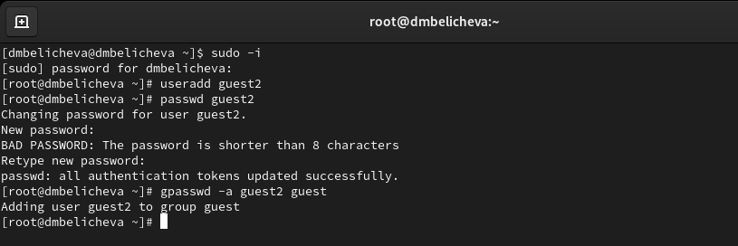
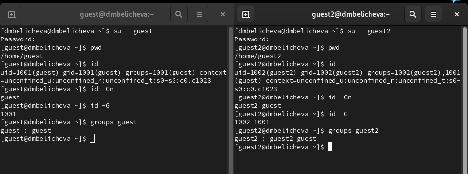
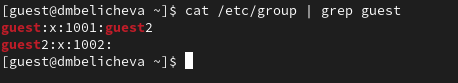
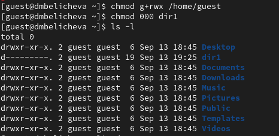
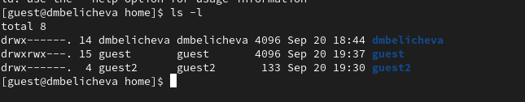

---
## Front matter
lang: ru-RU
title: Лабораторная работа №3
subtitle: Дискреционное разграничение прав в Linux. Два пользователя
author:
  - Беличева Д. М.
institute:
  - Российский университет дружбы народов, Москва, Россия

## i18n babel
babel-lang: russian
babel-otherlangs: english

## Formatting pdf
toc: false
toc-title: Содержание
slide_level: 2
aspectratio: 169
section-titles: true
theme: metropolis
header-includes:
 - \metroset{progressbar=frametitle,sectionpage=progressbar,numbering=fraction}
 - '\makeatletter'
 - '\beamer@ignorenonframefalse'
 - '\makeatother'
---

# Информация

## Докладчик

:::::::::::::: {.columns align=center}
::: {.column width="70%"}

  * Беличева Дарья Михайловна
  * студентка
  * Российский университет дружбы народов
  * [1032216453@pfur.ru](mailto:1032216453@pfur.ru)
  * <https://dmbelicheva.github.io/ru/>

:::
::: {.column width="25%"}

:::
::::::::::::::

## Цель работы

Получение практических навыков работы в консоли с атрибутами файлов для групп пользователей.

## Выполнение лабораторной работы

{#fig:001 width=70%}

## Выполнение лабораторной работы

{#fig:002 width=70%}

## Выполнение лабораторной работы

{#fig:003 width=70%}

## Выполнение лабораторной работы

{#fig:004 width=70%}

## Выполнение лабораторной работы

{#fig:005 width=70%}

## Выполнение лабораторной работы

: Минимальные права для совершения операций

| Операция             | Минимальные права на директорию | Минимальные права на файл |
|----------------------|---------------------------------|---------------------------|
|Создание файла        | d(030)                          | (000)                     |  
|Удаление файла        | d(030)                          | (000)                     |
|Чтение файла          | d(010)                          | (040)                     |   

## Выводы

В процессе выполнения данной лабораторной работы я получила практические навыки работы в консоли с атрибутами файлов для групп пользователей.

## Список литературы

1. Дискреционное разграничение доступа Linux [Электронный ресурс]. 2023. URL: https://debianinstall.ru/diskretsionnoe-razgranichenie-dostupa-linux/.