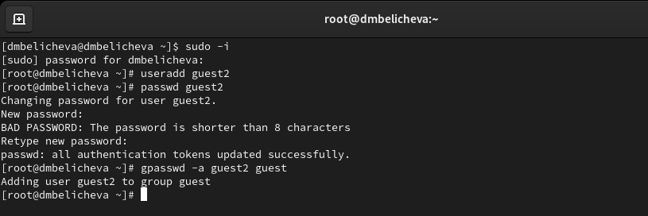
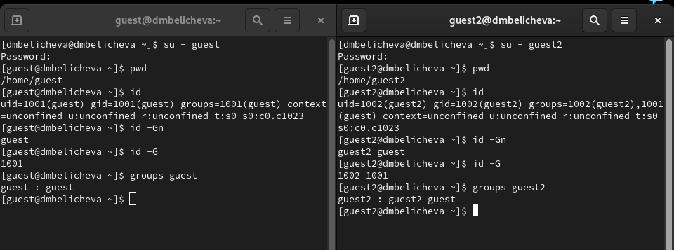
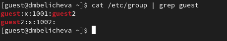
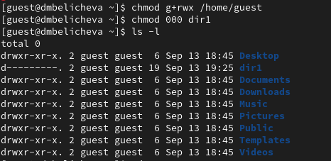
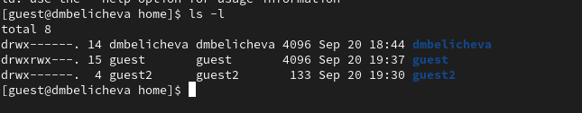

---
## Front matter
title: "Лабораторная работа №3"
subtitle: "Дискреционное разграничение прав в Linux. Два пользователя"
author: "Беличева Дарья Михайловна"

## Generic otions
lang: ru-RU
toc-title: "Содержание"

## Bibliography
bibliography: bib/cite.bib
csl: pandoc/csl/gost-r-7-0-5-2008-numeric.csl

## Pdf output format
toc: true # Table of contents
toc-depth: 2
lof: true # List of figures
lot: true # List of tables
fontsize: 12pt
linestretch: 1.5
papersize: a4
documentclass: scrreprt
## I18n polyglossia
polyglossia-lang:
  name: russian
  options:
	- spelling=modern
	- babelshorthands=true
polyglossia-otherlangs:
  name: english
## I18n babel
babel-lang: russian
babel-otherlangs: english
## Fonts
mainfont: PT Serif
romanfont: PT Serif
sansfont: PT Sans
monofont: PT Mono
mainfontoptions: Ligatures=TeX
romanfontoptions: Ligatures=TeX
sansfontoptions: Ligatures=TeX,Scale=MatchLowercase
monofontoptions: Scale=MatchLowercase,Scale=0.9
## Biblatex
biblatex: true
biblio-style: "gost-numeric"
biblatexoptions:
  - parentracker=true
  - backend=biber
  - hyperref=auto
  - language=auto
  - autolang=other*
  - citestyle=gost-numeric
## Pandoc-crossref LaTeX customization
figureTitle: "Рис."
tableTitle: "Таблица"
listingTitle: "Листинг"
lofTitle: "Список иллюстраций"
lotTitle: "Список таблиц"
lolTitle: "Листинги"
## Misc options
indent: true
header-includes:
  - \usepackage{indentfirst}
  - \usepackage{float} # keep figures where there are in the text
  - \floatplacement{figure}{H} # keep figures where there are in the text
---

# Цель работы

Получение практических навыков работы в консоли с атрибутами файлов для групп пользователей.

# Теоретическое введение

В Linux, как и в любой многопользовательской системе, абсолютно естественным образом возникает задача разграничения доступа субъектов — пользователей к объектам — файлам дерева каталогов.

Один из подходов к разграничению доступа — так называемый дискреционный (от англ, discretion — чье-либо усмотрение) — предполагает назначение владельцев объектов, которые по собственному усмотрению определяют права доступа субъектов (других пользователей) к объектам (файлам), которыми владеют.

Дискреционные механизмы разграничения доступа используются для разграничения прав доступа процессов как обычных пользователей, так и для ограничения прав системных программ в (например, служб операционной системы), которые работают от лица псевдопользовательских учетных записей [@discret_2018].

Основная команда для работы с правами в Linux: `chmod`.
Есть три основных вида прав:

* r -- чтение;
* w -- запись;
* x -- выполнение;
* s -- выполнение  от имени суперпользователя (дополнительный);
  
Также есть три категории пользователей, для которых вы можете установить эти права на файл linux:

* u -- владелец файла;
* g -- группа файла;
* o -- все остальные пользователи.

# Выполнение лабораторной работы

В установленной в предыдущей лабораторной работе операционной системе создадим учётную запись пользователя guest2 (использую учётную запись администратора), зададим пароль для пользователя guest2 и добавим пользователя guest2 в группу guest (рис. [-@fig:001]).

{#fig:001 width=70%}

Осуществим вход в систему от двух пользователей на двух разных консолях: guest на первой консоли и guest2 на второй консоли. Для обоих пользователей командой `pwd` определим директорию, в которой вы находитесь. Сравнив её с приглашениями командной строки, увидим, что они идентичны. Уточним имя пользователя, его группу, кто входит в неё и к каким группам принадлежит он сам. Определите командами
groups guest и groups guest2, в какие группы входят пользователи guest и guest2. Увидим, что guest принадлежит одной группе guest c id 1001, а guest2 -- двум группам guest и guest2 с id 1001 и 1002 соответственно. С помощью команд id -Gn и id -G можно увидеть только id существующих групп и название. Вывод команды `groups` идентичен выводу команды `id -Gn` (рис. [-@fig:002]).

{#fig:002 width=70%}

Сравним полученную информацию с содержимым файла /etc/group.
Просмотрим файл командой `cat /etc/group` с использованием фильтра `grep`, чтобы найти конкретную нужную информацию. Увидим, что полученная информация идентична с предыдущей (рис. [-@fig:003]).

{#fig:003 width=70%}

От имени пользователя guest2 выполним регистрацию пользователя
guest2 в группе guest командой `newgrp guest`.

От имени пользователя guest изменим права директории /home/guest,
разрешив все действия для пользователей группы: `chmod g+rwx /home/guest`. От имени пользователя guest снимем с директории /home/guest/dir1 все атрибуты командой
`chmod 000 dirl` и проверим правильность выполнения командой `ls -l` (рис. [-@fig:004]; [-@fig:005]).

{#fig:004 width=70%}

{#fig:005 width=70%}

Меняя атрибуты у директории dir1 и файла file1 от имени пользователя guest и делая проверку от пользователя guest2, заполним табл. [-@tbl:tbl1],
определив опытным путём, какие операции разрешены, а какие нет.

: Установленные права и разрешённые действия {#tbl:tbl1}

| Права директории | Права файла | Создание файла | Удаление файла | Запись в файл | Чтение файла | Смена директории | Просмотр файлов в директории | Переименование файла | Смена атрибутов файла |
|----------------------|-----------|--------|--------|--------|--------|--------|--------|--------|--------|
|d(000)            |(000)        |  -    |       -        |    -          | -            | -                | -                            | -                    | -                     |                                   
|d(010)            |(000)        |  -    |       -        |    -          | -            | +                | -                            | -                    | -                     |
|d(020)            |(000)        |  -    |       -        |    -          | -            | -                | -                            | -                    | -                     |
|d(030)            |(000)        |  +    |       +        |    -          | -            | +                | -                            | +                    | -                     |
|d(050)            |(000)        |  -    |       -        |    -          | -            | +                | +                            | -                    | -                     |
|d(040)            |(000)        |  -    |       -        |    -          | -            | -                | +                            | -                    | -                     |
|d(060)            |(000)        |  -    |       -        |    -          | -            | -                | +                            | -                    | -                     |
|d(070)            |(000)        |  +    |       +        |    -          | -            | +                | +                            | +                    | -                     |
|d(000)            |(010)        |  -    |       -        |    -          | -            | -                | -                            | -                    | -                     |
|d(010)            |(010)        |  -    |       -        |    -          | -            | +                | -                            | -                    | -                     |
|d(020)            |(010)        |  -    |       -        |    -          | -            | -                | -                            | -                    | -                     |
|d(030)            |(010)        |  +    |       +        |    -          | -            | +                | -                            | +                    | -                     |
|d(040)            |(010)        |  -    |       -        |    -          | -            | -                | +                            | -                    | -                     |
|d(050)            |(010)        |  -    |       -        |    -          | -            | +                | +                            | -                    | -                     |
|d(060)            |(010)        |  -    |       -        |    -          | -            | -                | +                            | -                    | -                     |
|d(070)            |(010)        |  +    |       +        |    -          | -            | +                | +                            | +                    | -                     |
|d(000)            |(020)        |  -    |       -        |    -          | -            | -                | -                            | -                    | -                     |
|d(010)            |(020)        |  -    |       -        |    +          | -            | +                | -                            | -                    | -                     |
|d(020)            |(020)        |  -    |       -        |    -          | -            | -                | -                            | -                    | -                     |
|d(030)            |(020)        |  +    |       +        |    +          | -            | +                | -                            | +                    | -                     |
|d(040)            |(020)        |  -    |       -        |    -          | -            | -                | +                            | -                    | -                     |
|d(050)            |(020)        |  -    |       -        |    +          | -            | +                | +                            | -                    | -                     |
|d(060)            |(020)        |  -    |       -        |    -          | -            | -                | +                            | -                    | -                     |
|d(070)            |(020)        |  +    |       +        |    +          | -            | +                | +                            | +                    | -                     |
|d(000)            |(030)        |  -    |       -        |    -          | -            | -                | -                            | -                    | -                     |
|d(010)            |(030)        |  -    |       -        |    +          | -            | +                | -                            | -                    | -                     |
|d(020)            |(030)        |  -    |       -        |    -          | -            | -                | -                            | -                    | -                     |
|d(030)            |(030)        |  +    |       +        |    +          | -            | +                | -                            | +                    | -                     |
|d(040)            |(030)        |  -    |       -        |    -          | -            | -                | +                            | -                    | -                     |
|d(050)            |(030)        |  -    |       -        |    +          | -            | +                | +                            | -                    | -                     |
|d(060)            |(030)        |  -    |       -        |    -          | -            | -                | +                            | -                    | -                     |
|d(070)            |(030)        |  +    |       +        |    +          | -            | +                | +                            | +                    | -                     |
|d(000)            |(040)        |  -    |       -        |    -          | -            | -                | -                            | -                    | -                     |
|d(010)            |(040)        |  -    |       -        |    -          | +            | +                | -                            | -                    | -                     |
|d(020)            |(040)        |  -    |       -        |    -          | -            | -                | -                            | -                    | -                     |
|d(030)            |(040)        |  +    |       +        |    -          | +            | +                | -                            | +                    | -                     |
|d(040)            |(040)        |  -    |       -        |    -          | -            | -                | +                            | -                    | -                     |
|d(050)            |(040)        |  -    |       -        |    -          | +            | +                | +                            | -                    | -                     |
|d(060)            |(040)        |  -    |       -        |    -          | -            | -                | +                            | -                    | -                     |
|d(070)            |(040)        |  +    |       +        |    -          | +            | +                | +                            | +                    | -                     |
|d(000)            |(050)        |  -    |       -        |    -          | -            | -                | -                            | -                    | -                     |
|d(010)            |(050)        |  -    |       -        |    -          | +            | +                | -                            | -                    | -                     |
|d(020)            |(050)        |  -    |       -        |    -          | -            | -                | -                            | -                    | -                     |
|d(030)            |(050)        |  +    |       +        |    -          | +            | +                | -                            | +                    | -                     |
|d(040)            |(050)        |  -    |       -        |    -          | -            | -                | +                            | -                    | -                     |
|d(050)            |(050)        |  -    |       -        |    -          | +            | +                | +                            | -                    | -                     |
|d(060)            |(050)        |  -    |       -        |    -          | -            | -                | +                            | -                    | -                     |
|d(070)            |(050)        |  +    |       +        |    -          | +            | +                | +                            | +                    | -                     |
|d(000)            |(060)        |  -    |       -        |    -          | -            | -                | -                            | -                    | -                     |
|d(010)            |(060)        |  -    |       -        |    +          | +            | +                | -                            | -                    | -                     |
|d(020)            |(060)        |  -    |       -        |    -          | -            | -                | -                            | -                    | -                     |
|d(030)            |(060)        |  +    |       +        |    +          | +            | +                | -                            | +                    | -                     |
|d(040)            |(060)        |  -    |       -        |    -          | -            | -                | +                            | -                    | -                     |
|d(050)            |(060)        |  -    |       -        |    +          | +            | +                | +                            | -                    | -                     |
|d(060)            |(060)        |  -    |       -        |    -          | -            | -                | +                            | -                    | -                     |
|d(070)            |(060)        |  +    |       +        |    +          | +            | +                | +                            | +                    | -                     |
|d(000)            |(070)        |  -    |       -        |    -          | -            | -                | -                            | -                    | -                     |
|d(010)            |(070)        |  -    |       -        |    +          | +            | +                | -                            | -                    | -                     |
|d(020)            |(070)        |  -    |       -        |    -          | -            | -                | -                            | -                    | -                     |
|d(030)            |(070)        |  +    |       +        |    +          | +            | +                | -                            | +                    | -                     |
|d(040)            |(070)        |  -    |       -        |    -          | -            | -                | +                            | -                    | -                     |
|d(050)            |(070)        |  -    |       -        |    +          | +            | +                | +                            | -                    | -                     |
|d(060)            |(070)        |  -    |       -        |    -          | -            | -                | +                            | -                    | -                     |
|d(070)            |(070)        |  +    |       +        |    +          | +            | +                | +                            | +                    | -                     |

В табл. [-@tbl:tbl2] приведены данные о том, какие минимальные права должны быть для совершения различных действий.

: Минимальные права для совершения операций {#tbl:tbl2}

| Операция             | Минимальные права на директорию | Минимальные права на файл |
|----------------------|---------------------------------|---------------------------|
|Создание файла        | d(030)                          | (000)                     |  
|Удаление файла        | d(030)                          | (000)                     |
|Чтение файла          | d(010)                          | (040)                     |  
|Запись в файл         | d(010)                          | (020)                     |
|Переименование файла  | d(030)                          | (000)                     |
|Создание поддиректории| d(030)                          | (000)                     |
|Удаление поддиректории| d(030)                          | (000)                     |        

# Выводы

В процессе выполнения данной лабораторной работы я получила практические навыки работы в консоли с атрибутами файлов для групп пользователей.

# Список литературы{.unnumbered}

::: {#refs}
:::
