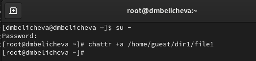
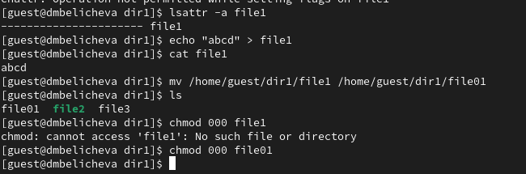

---
## Front matter
title: "Лабораторная работа № 4"
subtitle: "Дискреционное разграничение прав в Linux. Расширенные атрибуты"
author: "Беличева Дарья Михайловна"

## Generic otions
lang: ru-RU
toc-title: "Содержание"

## Bibliography
bibliography: bib/cite.bib
csl: pandoc/csl/gost-r-7-0-5-2008-numeric.csl

## Pdf output format
toc: true # Table of contents
toc-depth: 2
lof: true # List of figures
lot: false # List of tables
fontsize: 12pt
linestretch: 1.5
papersize: a4
documentclass: scrreprt
## I18n polyglossia
polyglossia-lang:
  name: russian
  options:
	- spelling=modern
	- babelshorthands=true
polyglossia-otherlangs:
  name: english
## I18n babel
babel-lang: russian
babel-otherlangs: english
## Fonts
mainfont: PT Serif
romanfont: PT Serif
sansfont: PT Sans
monofont: PT Mono
mainfontoptions: Ligatures=TeX
romanfontoptions: Ligatures=TeX
sansfontoptions: Ligatures=TeX,Scale=MatchLowercase
monofontoptions: Scale=MatchLowercase,Scale=0.9
## Biblatex
biblatex: true
biblio-style: "gost-numeric"
biblatexoptions:
  - parentracker=true
  - backend=biber
  - hyperref=auto
  - language=auto
  - autolang=other*
  - citestyle=gost-numeric
## Pandoc-crossref LaTeX customization
figureTitle: "Рис."
tableTitle: "Таблица"
listingTitle: "Листинг"
lofTitle: "Список иллюстраций"
lotTitle: "Список таблиц"
lolTitle: "Листинги"
## Misc options
indent: true
header-includes:
  - \usepackage{indentfirst}
  - \usepackage{float} # keep figures where there are in the text
  - \floatplacement{figure}{H} # keep figures where there are in the text
---

# Цель работы

Получение практических навыков работы в консоли с расширенными
атрибутами файлов.

# Теоретическое введение

В Linux, как и в любой многопользовательской системе, абсолютно естественным образом возникает задача разграничения доступа субъектов — пользователей к объектам — файлам дерева каталогов.

Один из подходов к разграничению доступа — так называемый дискреционный (от англ, discretion — чье-либо усмотрение) — предполагает назначение владельцев объектов, которые по собственному усмотрению определяют права доступа субъектов (других пользователей) к объектам (файлам), которыми владеют.

Дискреционные механизмы разграничения доступа используются для разграничения прав доступа процессов как обычных пользователей, так и для ограничения прав системных программ в (например, служб операционной системы), которые работают от лица псевдопользовательских учетных записей [@discret_2018].

Основная команда для работы с правами в Linux: `chmod`.
Есть три основных вида прав:

* r -- чтение;
* w -- запись;
* x -- выполнение;
* s -- выполнение  от имени суперпользователя (дополнительный);
  
Также есть три категории пользователей, для которых вы можете установить эти права на файл linux:

* u -- владелец файла;
* g -- группа файла;
* o -- все остальные пользователи.

# Выполнение лабораторной работы

От имени пользователя guest определим расширенные атрибуты файла
/home/guest/dir1/file1 командой
`lsattr /home/guest/dir1/file1`. Пока что расширенных атрибутов нет. Установим командой
`chmod 600 file1` на файл file1 права, разрешающие чтение и запись для владельца файла.
Попробуем установить на файл /home/guest/dir1/file1 расширенный атрибут a от имени пользователя guest:
`chattr +a /home/guest/dir1/file1`
В ответ получим отказ от выполнения операции (рис. [-@fig:001]).

{#fig:001 width=70%}

Зайдем на другую консоль с правами администратора. Попробуем установить расширенный атрибут `a` на файл /home/guest/dir1/file1 от имени суперпользователя:
`chattr +a /home/guest/dir1/file1`. Теперь у нас получилось это сделать (рис. [-@fig:002]).

{#fig:002 width=70%}

От пользователя guest проверим правильность установления атрибута:
`lsattr /home/guest/dir1/file1`. Увидим, что атрибут `a` действительно установился.
Выполним дозапись в файл file1 слова «test» командой
`echo "test" >> /home/guest/dir1/file1`.
После этого выполним чтение файла file1 командой
`cat /home/guest/dir1/file1`.
Слово test было успешно записано в file1.
Попробуем удалить файл file1 либо стереть имеющуюся в нём информацию командой
`echo "abcd" > /home/guest/dirl/file1`, переименовать файл и изменить права файла, но никакие из этих действий у нас не выполняется (доступ запрещен) (рис. [-@fig:003]).

{#fig:003 width=70%}

Снимем расширенный атрибут `a` с файла /home/guest/dirl/file1 от
имени суперпользователя командой
`chattr -a /home/guest/dir1/file1`.
Повторим операции, которые ранее не удавалось выполнить. Теперь все операции выполняются успешно (рис. [-@fig:004]).

{#fig:004 width=70%}

Повторим действия по шагам, заменив атрибут «a» атрибутом «i». Теперь нам запрещены любые действия, в том числе и дозапись информации в файл (рис. [-@fig:005]).

{#fig:005 width=70%}

# Выводы

В процессе выполнения данной лабораторной работы я получила практические навыки работы в консоли с расширенными
атрибутами файлов.

# Список литературы{.unnumbered}

::: {#refs}
:::
