---
## Front matter
title: "Лабораторная работа № 5"
subtitle: "Дискреционное разграничение прав в Linux. Исследование влияния дополнительных атрибутов"
author: "Беличева Дарья Михайловна"

## Generic otions
lang: ru-RU
toc-title: "Содержание"

## Bibliography
bibliography: bib/cite.bib
csl: pandoc/csl/gost-r-7-0-5-2008-numeric.csl

## Pdf output format
toc: true # Table of contents
toc-depth: 2
lof: true # List of figures
lot: false # List of tables
fontsize: 12pt
linestretch: 1.5
papersize: a4
documentclass: scrreprt
## I18n polyglossia
polyglossia-lang:
  name: russian
  options:
	- spelling=modern
	- babelshorthands=true
polyglossia-otherlangs:
  name: english
## I18n babel
babel-lang: russian
babel-otherlangs: english
## Fonts
mainfont: PT Serif
romanfont: PT Serif
sansfont: PT Sans
monofont: PT Mono
mainfontoptions: Ligatures=TeX
romanfontoptions: Ligatures=TeX
sansfontoptions: Ligatures=TeX,Scale=MatchLowercase
monofontoptions: Scale=MatchLowercase,Scale=0.9
## Biblatex
biblatex: true
biblio-style: "gost-numeric"
biblatexoptions:
  - parentracker=true
  - backend=biber
  - hyperref=auto
  - language=auto
  - autolang=other*
  - citestyle=gost-numeric
## Pandoc-crossref LaTeX customization
figureTitle: "Рис."
tableTitle: "Таблица"
listingTitle: "Листинг"
lofTitle: "Список иллюстраций"
lotTitle: "Список таблиц"
lolTitle: "Листинги"
## Misc options
indent: true
header-includes:
  - \usepackage{indentfirst}
  - \usepackage{float} # keep figures where there are in the text
  - \floatplacement{figure}{H} # keep figures where there are in the text
---

# Цель работы

Изучение механизмов изменения идентификаторов, применения
SetUID- и Sticky-битов. Получение практических навыков работы в консоли с дополнительными атрибутами. Рассмотрение работы механизма
смены идентификатора процессов пользователей, а также влияние бита
Sticky на запись и удаление файлов.

# Теоретическое введение

В области разрешений Linux, SUID (установка идентификатора пользователя), SGID (установка идентификатора группы) и Sticky Bit являются критическими атрибутами, которые выходят за рамки стандартных разрешений для файлов, обеспечивая мощные функциональные возможности, такие как предоставление временных привилегий, контроль группового доступа и сохранение целостности данных [@discret].

SUID, сокращение от Set User ID, представляет собой специальное разрешение, которое может быть назначено исполняемым файлам. Когда у исполняемого файла включено разрешение SUID, это позволяет пользователям, выполняющим файл, временно принимать привилегии владельца файла. Это означает, что даже если у пользователя нет необходимых разрешений для доступа или выполнения определенных действий, он может сделать это, запустив файл с разрешением SUID.

SGID, что означает Set Group ID, — это ещё одно специальное разрешение, которое можно применить к исполняемым файлам и каталогам. Если для исполняемого файла включено разрешение SGID, это позволяет пользователям, которые запускают файл, временно стать владельцами группы, к которой относится файл. Для каталогов с включённым разрешением SGID вновь созданные файлы и каталоги в этом каталоге наследуют принадлежность к группе родительского каталога, а не принадлежность к группе пользователя по умолчанию.

Sticky Bit -- это специальное разрешение, которое можно установить только для каталогов. Когда залипание включено для каталога, оно ограничивает возможность удаления или переименования файлов в этом каталоге для владельца файла, владельца каталога и суперпользователя. Это гарантирует, что каждый пользователь может удалять или изменять только свои файлы, даже если у него есть права на запись в каталог.

# Выполнение лабораторной работы

Установим компилятор gcc, а также отключим SELinux (рис. [-@fig:001]).

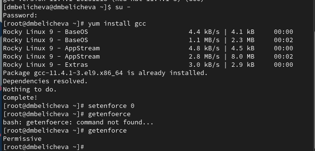{#fig:001 width=70%}

Войдем в систему от имени пользователя guest и создадим программу simpleid.c (рис. [-@fig:002]).

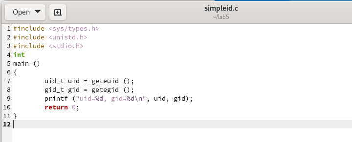{#fig:002 width=70%}

Скомпилируем программу и убедимся, что файл программы создан. Далее выполним программу simpleid, нам выведутся uid и gid. Выполним системную программу `id` и сравним полученный результат с данными предыдущего пункта
задания (рис. [-@fig:003]). Увидим, что информация идентична.

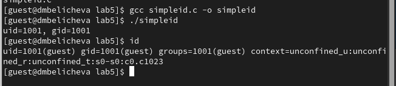{#fig:003 width=70%}

Усложните программу, добавив вывод действительных идентификаторов (рис. [-@fig:004]).

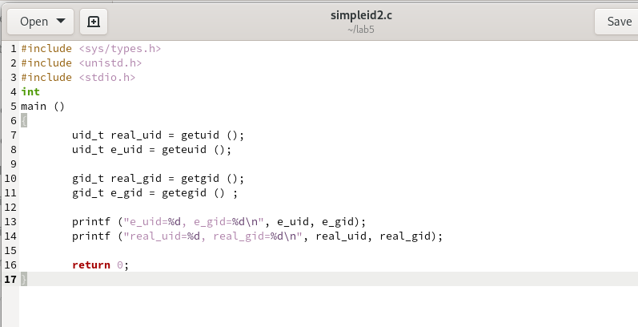{#fig:004 width=70%}

Скомпилируем программу и убедимся, что файл программы создан. Далее выполним программу simpleid, нам выведутся uid и gid, а также их действительные идентификаторы (рис. [-@fig:005]).

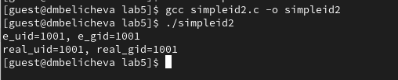{#fig:005 width=70%}

От имени суперпользователя изменим владельца файла /home/guest/simpleid2 и установим SetUID-бит. Проверим корректность установленных прав и опять запустим simpleid2 (рис. [-@fig:006]).

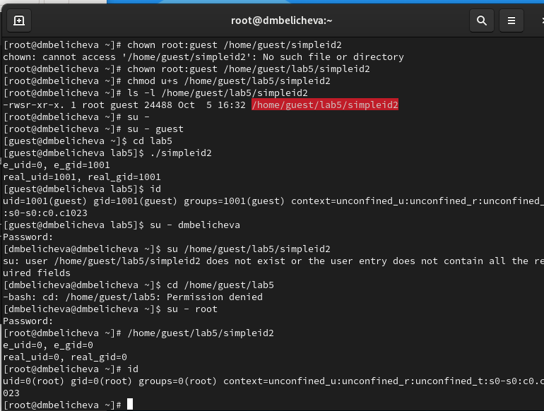{#fig:006 width=70%}

Проделаем тоже самое относительно SetGID-бита (рис. [-@fig:007]).

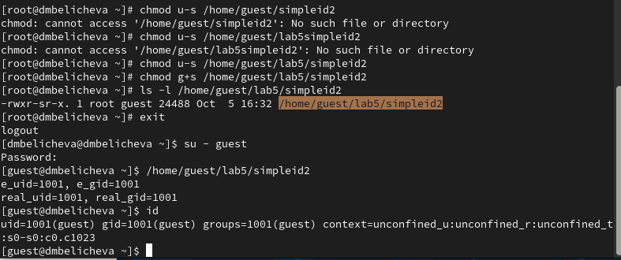{#fig:007 width=70%}

Создадим программу readfile.c (рис. [-@fig:008]).

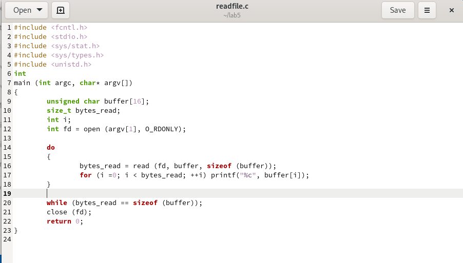{#fig:008 width=70%}

Откомпилируем её. Сменим владельца у файла readfile.c на root и изменим права так, чтобы только суперпользователь (root) мог прочитать его, a guest не мог. Для этого изменим права файла на 700, то есть только пользователю (root) разрешены все действия. Проверим, что пользователь guest не может прочитать файл readfile.c (рис. [-@fig:009]).

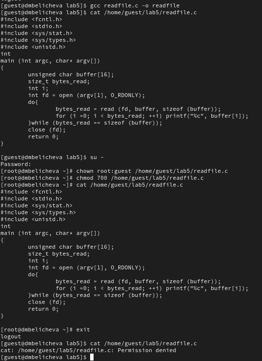{#fig:009 width=70%}

Сменим у программы readfile владельца и установим SetUID-бит. Убедимся, что программа readfile может прочитать файл readfile.c. Также проверим, что программа readfile может прочитать файл /etc/shadow (рис. [-@fig:010]).

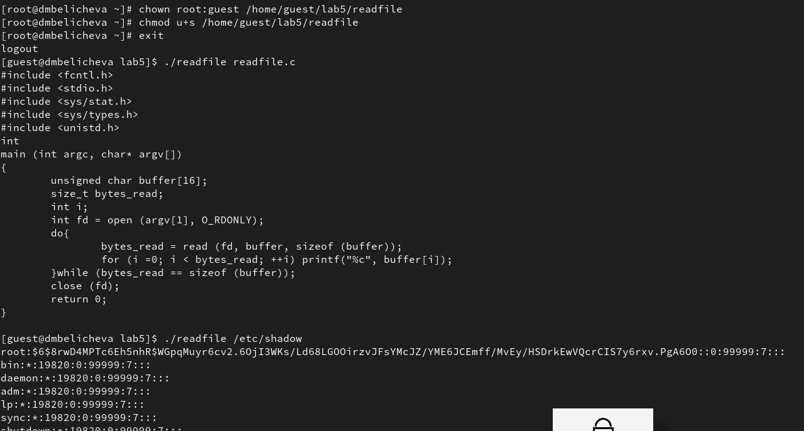{#fig:010 width=70%}

Проверим, что установлен атрибут Sticky на директории /tmp (в конце стоит t). Затем от имени пользователя guest создадим файл file01.txt в директории /tmp со словом test, затем просмотрим атрибуты у только что созданного файла и разрешим чтение и запись для категории пользователей «все остальные». После этого от пользователя guest2 попробуем дозаписать в этот файл новое слово, однако получим отказ, также нам отказано в перезаписи и удалении этого файла. Если же убрать Sticky бит, то нам будет разрешено удаление этого файла (рис. [-@fig:011]).

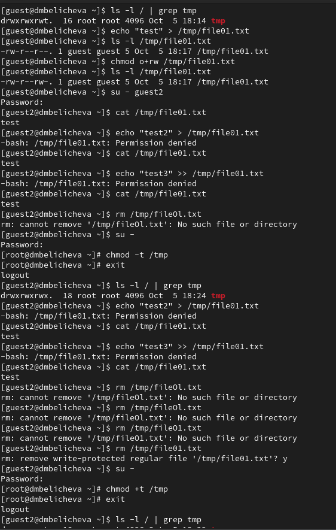{#fig:011 width=70%}

# Выводы

В процессе выполнения данной лабораторной работы я изучила механизмы изменения идентификаторов, применения
SetUID- и Sticky-битов. Получила практические навыки работы в консоли с дополнительными атрибутами. Рассмотрела работы механизма
смены идентификатора процессов пользователей, а также влияние бита
Sticky на запись и удаление файлов.

# Список литературы{.unnumbered}

::: {#refs}
:::
