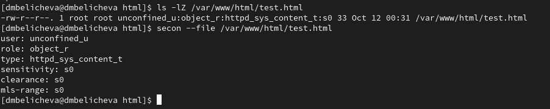

---
## Front matter
title: "Лабораторная работа № 6"
subtitle: "Мандатное разграничение прав в Linux"
author: "Беличева Дарья Михайловна"

## Generic otions
lang: ru-RU
toc-title: "Содержание"

## Bibliography
bibliography: bib/cite.bib
csl: pandoc/csl/gost-r-7-0-5-2008-numeric.csl

## Pdf output format
toc: true # Table of contents
toc-depth: 2
lof: true # List of figures
lot: false # List of tables
fontsize: 12pt
linestretch: 1.5
papersize: a4
documentclass: scrreprt
## I18n polyglossia
polyglossia-lang:
  name: russian
  options:
	- spelling=modern
	- babelshorthands=true
polyglossia-otherlangs:
  name: english
## I18n babel
babel-lang: russian
babel-otherlangs: english
## Fonts
mainfont: PT Serif
romanfont: PT Serif
sansfont: PT Sans
monofont: PT Mono
mainfontoptions: Ligatures=TeX
romanfontoptions: Ligatures=TeX
sansfontoptions: Ligatures=TeX,Scale=MatchLowercase
monofontoptions: Scale=MatchLowercase,Scale=0.9
## Biblatex
biblatex: true
biblio-style: "gost-numeric"
biblatexoptions:
  - parentracker=true
  - backend=biber
  - hyperref=auto
  - language=auto
  - autolang=other*
  - citestyle=gost-numeric
## Pandoc-crossref LaTeX customization
figureTitle: "Рис."
tableTitle: "Таблица"
listingTitle: "Листинг"
lofTitle: "Список иллюстраций"
lotTitle: "Список таблиц"
lolTitle: "Листинги"
## Misc options
indent: true
header-includes:
  - \usepackage{indentfirst}
  - \usepackage{float} # keep figures where there are in the text
  - \floatplacement{figure}{H} # keep figures where there are in the text
---

# Цель работы

Развить навыки администрирования ОС Linux. Получить первое практическое знакомство с технологией SELinux.
Проверить работу SELinx на практике совместно с веб-сервером Apache.

# Теоретическое введение

SELinux (англ. Security-Enhanced Linux — Linux с улучшенной безопасностью) — реализация системы мандатного управления доступа, которая может работать параллельно с классической избирательной системой контроля доступа[@wiki].

Домен -- список действий, которые может выполнять процесс. Обычно в качестве домена определяется минимально-возможный набор действий, при помощи которых процесс способен функционировать. Таким образом, если процесс дискредитирован, злоумышленнику не удастся нанести большого вреда.

Роль -- список доменов, которые могут быть применены. Если какого-то домена нет в списке доменов какой-то роли, то действия из этого домена не могут быть применены.

Тип -- набор действий, которые допустимы по отношения к объекту. Тип отличается от домена тем, что он может применяться к пайпам, каталогам и файлам, в то время как домен применяется к процессам.

Контекст безопасности -- все атрибуты SELinux — роли, типы и домены.

# Выполнение лабораторной работы

Подготовим лабораторный стенд: установим веб-сервер Apache, а в конфигурационном файле /etc/httpd/httpd.conf  зададим параметр ServerName (рис. [-@fig:001]).

{#fig:001 width=70%}

Далее отключим пакетный фильтр (рис. [-@fig:002]).

{#fig:002 width=70%}

Войдем в систему с полученными учётными данными и убедитимся, что
SELinux работает в режиме enforcing политики targeted с помощью команд `getenforce` и `sestatus`.

{#fig:003 width=70%}

Обратимся с помощью браузера к веб-серверу, запущенному на нашем компьютере, и убедимся, что последний работает(рис. [-@fig:004]).

{#fig:004 width=70%}

Найдем веб-сервер Apache в списке процессов, определим его контекст
безопасности (рис. [-@fig:005]). Информация о контексте находится в первом столбце.

{#fig:005 width=70%}

Посмотрим текущее состояние переключателей SELinux для Apache с
помощью команды (рис. [-@fig:006]).

{#fig:006 width=70%}

Посмотрим статистику по политике с помощью команды `seinfo`, также
определите множество пользователей, ролей, типов (рис. [-@fig:007];[-@fig:008]).

{#fig:007 width=70%}

{#fig:008 width=70%}

Определите тип файлов и поддиректорий, находящихся в директории
/var/www (рис. [-@fig:009]). Увидим, что есть директория, содержащая cgi-скрипты, и директория /var/www/html, содержащая все скрипты httpd(в данный момент пустая).
 
{#fig:009 width=70%}

Создадим от имени суперпользователя (так как в дистрибутиве после установки только ему разрешена запись в директорию) html-файл
/var/www/html/test.html следующего содержания (рис. [-@fig:010]).

{#fig:010 width=70%}

Проверим контекст созданного вами файла, который был задан по умолчанию этому файлу (рис. [-@fig:011]). Увидим, что файлам по умолчанию сопоставляется свободный пользователь SELinux unconfined_u, указана роль  object_r используется по умолчанию для файлов на «постоянных» носителях и на сетевых файловых системах и тип httpd_sys_content_t, который позволяет процессу httpd получить доступ к файлу.

{#fig:011 width=70%}

Обратимся к файлу через веб-сервер, введя в браузере адрес
http://127.0.0.1/test.html. Убедимся, что файл успешно отображается (рис. [-@fig:012]).

{#fig:012 width=70%}

Изучив справку man httpd_selinux, выясним, какие контексты файлов определены для httpd. Сопоставив их с типом файла test.html увидим, что его контекст httpd_sys_content_t для содержимого, которое должно быть доступно для всех скриптов httpd и для самого демона. 

Изменим контекст файла /var/www/html/test.html с httpd_sys_content_t на тот, к которому процесс httpd не должен иметь доступа -- samba_share_t (рис. [-@fig:013]).

{#fig:013 width=70%}

Теперь снова попробуем получить доступ к файлу через браузер и получим отказ (рис. [-@fig:014]).

{#fig:014 width=70%}

Посмотрим log-файлы веб-сервера Apache и системный лог-файл и увидим, что отказ происходит, так как доступ запрещен SELinux именно к веб-серверу(на просто просмотр текстовых файлов это не влияет) (рис. [-@fig:015]).

{#fig:015 width=70%}

Запустим веб-сервер Apache на прослушивание ТСР-порта 81. Для этого в файле /etc/httpd/httpd.conf найдем строчку Listen 80 и заменим её на Listen 81 (рис. [-@fig:016]).

{#fig:016 width=70%}

Выполним перезапуск веб-сервера Apache. Произошёл сбой, потому что порт
80 для локальной сети, а 81 нет (рис. [-@fig:017]).

{#fig:017 width=70%}

В логах можно увидеть запуск сервера через порт 81 (рис. [-@fig:018]).

{#fig:018 width=70%}

Проверим какие порты у нас добавлены в semanage (рис. [-@fig:019]).

{#fig:019 width=70%}

Вернем контекст httpd_sys_cоntent__t к файлу /var/www/html/ test.html (рис. [-@fig:020])..
После этого попробуем получить доступ к файлу через веб-сервер, введя в браузере адрес http://127.0.0.1:81/test.html. Доступ успешно получен.
Увидим содержимое файла -- слово «test» (рис. [-@fig:021]).

{#fig:020 width=70%}

{#fig:021 width=70%}

Исправим обратно конфигурационный файл apache, вернув Listen 80. Удалим привязку http_port_t к 81 порту.
Удалим файл /var/www/html/test.html:

# Выводы

В результате выполнения данной лабораторной работы мною были развиты навыки администрирования ОС Linux, получено первое практическое знакомство с технологией SELinux, а также
проверена работа SELinx на практике совместно с веб-сервером Apache.

# Список литературы{.unnumbered}

::: {#refs}
:::
