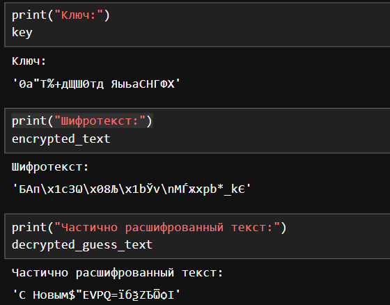

---
## Front matter
lang: ru-RU
title: Лабораторная работа № 7
subtitle: Элементы криптографии. Однократное гаммирование
author:
  - Беличева Д. М.
institute:
  - Российский университет дружбы народов, Москва, Россия

## i18n babel
babel-lang: russian
babel-otherlangs: english

## Formatting pdf
toc: false
toc-title: Содержание
slide_level: 2
aspectratio: 169
section-titles: true
theme: metropolis
header-includes:
 - \metroset{progressbar=frametitle,sectionpage=progressbar,numbering=fraction}
 - '\makeatletter'
 - '\beamer@ignorenonframefalse'
 - '\makeatother'
---

# Информация

## Докладчик

:::::::::::::: {.columns align=center}
::: {.column width="70%"}

  * Беличева Дарья Михайловна
  * студентка
  * Российский университет дружбы народов
  * [1032216453@pfur.ru](mailto:1032216453@pfur.ru)
  * <https://dmbelicheva.github.io/ru/>

:::
::: {.column width="25%"}


:::
::::::::::::::

## Цель работы

Освоить на практике применение режима однократного гаммирования.

## Выполнение лабораторной работы

```Python
import random

def key_gen(text):
    cirillic = [chr(i) for i in range(1040,1104)]
    symbols = [chr(i) for i in range(32,65)]
    all_characters = cirillic + symbols
    return ''.join([random.choice(all_characters) for i in range(len(text))])
```

## Выполнение лабораторной работы

```Python
def xor(text,key):
    return ''.join(chr(ord(a)^ord(b)) for a,b in zip(text,key))
```

## Выполнение лабораторной работы

```Python
def part_key_gen(fragment, encrypted_text):
    start_key = xor(fragment,encrypted_text[:len(fragment)])
    remaining_length = len(encrypted_text) - len(fragment)
    key_rest = key_gen(' ' * remaining_length)
    return start_key + key_rest
```

## Выполнение лабораторной работы

```Python
text = 'С Новым годом, друзья!'
key = key_gen(text)
encrypted_text = xor(text,key)
fragment = 'С Новым'
partial_key = part_key_gen(fragment, encrypted_text)
decrypted_guess_text = xor(encrypted_text,partial_key)
```

## Выполнение лабораторной работы

{#fig:001 width=60%}

## Выводы

В результате выполнения данной лабораторной работы я освоила на практике применение режима однократного гаммирования.

## Список литературы

1. Гаммирование [Электронный ресурс]. 2023. URL: https://ru.wikipedia.org/wiki/Гаммирование.