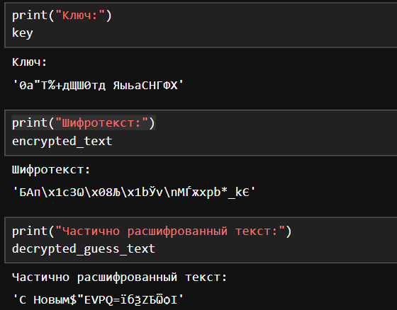

---
## Front matter
title: "Лабораторная работа № 7"
subtitle: "Элементы криптографии. Однократное гаммирование"
author: "Беличева Дарья Михайловна"

## Generic otions
lang: ru-RU
toc-title: "Содержание"

## Bibliography
bibliography: bib/cite.bib
csl: pandoc/csl/gost-r-7-0-5-2008-numeric.csl

## Pdf output format
toc: true # Table of contents
toc-depth: 2
lof: true # List of figures
lot: false # List of tables
fontsize: 12pt
linestretch: 1.5
papersize: a4
documentclass: scrreprt
## I18n polyglossia
polyglossia-lang:
  name: russian
  options:
	- spelling=modern
	- babelshorthands=true
polyglossia-otherlangs:
  name: english
## I18n babel
babel-lang: russian
babel-otherlangs: english
## Fonts
mainfont: PT Serif
romanfont: PT Serif
sansfont: PT Sans
monofont: PT Mono
mainfontoptions: Ligatures=TeX
romanfontoptions: Ligatures=TeX
sansfontoptions: Ligatures=TeX,Scale=MatchLowercase
monofontoptions: Scale=MatchLowercase,Scale=0.9
## Biblatex
biblatex: true
biblio-style: "gost-numeric"
biblatexoptions:
  - parentracker=true
  - backend=biber
  - hyperref=auto
  - language=auto
  - autolang=other*
  - citestyle=gost-numeric
## Pandoc-crossref LaTeX customization
figureTitle: "Рис."
tableTitle: "Таблица"
listingTitle: "Листинг"
lofTitle: "Список иллюстраций"
lotTitle: "Список таблиц"
lolTitle: "Листинги"
## Misc options
indent: true
header-includes:
  - \usepackage{indentfirst}
  - \usepackage{float} # keep figures where there are in the text
  - \floatplacement{figure}{H} # keep figures where there are in the text
---

# Цель работы

Освоить на практике применение режима однократного гаммирования.

# Теоретическое введение

Гаммиирование, или Шифр XOR, — метод симметричного шифрования, заключающийся в «наложении» последовательности, состоящей из случайных чисел, на открытый текст. Последовательность случайных чисел называется гамма-последовательностью и используется для зашифровывания и расшифровывания данных[@wiki].

# Выполнение лабораторной работы

Создадим функцию `key_gen()` для генерации случайного ключа, с помощью которого происходит шифрование. Ключ рандомно генерируется из строчных и заглавных букв русского алфавита, а также из специальных символов. Самое главное в генерации ключа -- он такой же длины, что и текст, который шифруется.

Далее создаем функцию `xor()` для применения созданного ключа к исходному тексту (собственно однократное гаммирование), чтобы в итоге получить зашифрованный текст. Здесь у нас выполняется поэлементное сложения по модулю 2.

Чтобы воссоздать ситуацию, когда нужно расшифровать текст, зная только фрагмент исходного сообщения и сам зашифрованный текст, реализуем функцию `part_key_gen()`. Здесь мы воссоздаем часть оригинального ключа, которая соответствует известному нам фрагменту исходного текста. Затем создаем свой случайный ключ для оставшейся части текста, соединяем два ключа и что-то получаем.

```Python
import random

def key_gen(text):
    cirillic = [chr(i) for i in range(1040,1104)]
    symbols = [chr(i) for i in range(32,65)]
    all_characters = cirillic + symbols
    return ''.join([random.choice(all_characters) for i in range(len(text))])

def xor(text,key):
    return ''.join(chr(ord(a)^ord(b)) for a,b in zip(text,key))

def part_key_gen(fragment, encrypted_text):
    start_key = xor(fragment,encrypted_text[:len(fragment)])
    remaining_length = len(encrypted_text) - len(fragment)
    key_rest = key_gen(' ' * remaining_length)
    return start_key + key_rest
```

Применим написанные функции на примере:

```Python
text = 'С Новым годом, друзья!'
key = key_gen(text)
encrypted_text = xor(text,key)
fragment = 'С Новым'
partial_key = part_key_gen(fragment, encrypted_text)
decrypted_guess_text = xor(encrypted_text,partial_key)
```

В результате получаем (рис. [-@fig:001]): 

- случайный ключ той же длины, что и текст;
- зашифрованный текст;
- предположительный расшифрованный текст (исходя из известного фрагмента).

{#fig:001 width=70%}

Как и ожидалось, с помощью такого ключа восстановилась только известная часть, остальное сообщение восстановить не удалось.
Мы бы смогли восстановить полностью исходный текст, только если бы у нас был оригинальный ключ.

# Контрольные вопросы

1. Поясните смысл однократного гаммирования.

Гаммиирование, или Шифр XOR, — метод симметричного шифрования, заключающийся в «наложении» последовательности, состоящей из случайных чисел, на открытый текст. Если в методе шифрования используется однократная вероятностная гамма (однократное гаммирование) той же длины, что и подлежащий сокрытию текст, то текст нельзя раскрыть.

2. Перечислите недостатки однократного гаммирования.

- Если один и тот же ключ используется для шифрования нескольких сообщений, это может привести к уязвимостям. Например, если злоумышленник узнает открытый текст и соответствующий шифротекст, он может использовать эту информацию для взлома ключа.

- Однократное гаммирование не обеспечивает аутентификацию или целостность данных. Это означает, что злоумышленник может изменить шифротекст без заметных изменений в открытом тексте.

3. Перечислите преимущества однократного гаммирования.

- Однократное гаммирование обеспечивает высокий уровень конфиденциальности, поскольку шифротекст не может быть легко взломан без знания ключа.

- Однократное гаммирование обеспечивает равномерное распределение вероятностей для каждого символа в шифротексте, что делает его статистически неразличимым от случайной последовательности.

- Однократное гаммирование является простым и быстрым методом шифрования.

4. Почему длина открытого текста должна совпадать с длиной ключа?

Если в методе шифрования используется однократная вероятностная гамма (однократное гаммирование) той же длины, что и подлежащий сокрытию текст, то текст нельзя раскрыть.

5. Какая операция используется в режиме однократного гаммирования, назовите её особенности?

В режиме однократного гаммирования используется операция XOR (исключающее ИЛИ). Операция XOR комбинирует биты открытого текста и ключа, чтобы получить шифротекст. Особенностью операции XOR является то, что она возвращает 1 только в том случае, если один из входных битов равен 1, но не оба.

6. Как по открытому тексту и ключу получить шифротекст?

Нужно побитово сложить по модулю численное представление символов в ключе и в открытом тексте.

7. Как по открытому тексту и шифротексту получить ключ?

Нужно побитово сложить по модулю численное представление символов в шифротексте и в открытом текст

8. В чем заключаются необходимые и достаточные условия абсолютной
стойкости шифра?

Необходимые и достаточные условия абсолютной стойкости шифра:

- полная случайность ключа;

- равенство длин ключа и открытого текста;

- однократное использование ключа.

# Выводы

В результате выполнения данной лабораторной работы я освоила на практике применение режима однократного гаммирования.

# Список литературы{.unnumbered}

::: {#refs}
:::
