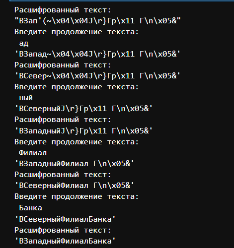

---
## Front matter
lang: ru-RU
title: Лабораторная работа №8
subtitle: Элементы криптографии. Шифрование (кодирование) различных исходных текстов одним ключом
author:
  - Беличева Д. М.
institute:
  - Российский университет дружбы народов, Москва, Россия

## i18n babel
babel-lang: russian
babel-otherlangs: english

## Formatting pdf
toc: false
toc-title: Содержание
slide_level: 2
aspectratio: 169
section-titles: true
theme: metropolis
header-includes:
 - \metroset{progressbar=frametitle,sectionpage=progressbar,numbering=fraction}
 - '\makeatletter'
 - '\beamer@ignorenonframefalse'
 - '\makeatother'
---

# Информация

## Докладчик

:::::::::::::: {.columns align=center}
::: {.column width="70%"}

  * Беличева Дарья Михайловна
  * студентка
  * Российский университет дружбы народов
  * [1032216453@pfur.ru](mailto:1032216453@pfur.ru)
  * <https://dmbelicheva.github.io/ru/>

:::
::: {.column width="25%"}


:::
::::::::::::::

## Цель работы

Освоить на практике применение режима однократного гаммирования
на примере кодирования различных исходных текстов одним ключом.

## Выполнение лабораторной работы

```Python
def key_gen(text):
    cirillic = [chr(i) for i in range(1040,1104)]
    symbols = [chr(i) for i in range(32,65)]
    all_characters = cirillic + symbols
    return ''.join([random.choice(all_characters) for i in range(len(text))])

def xor(text,key):
    return ''.join([chr(ord(a)^ord(b)) for a,b in zip(text,key)])
```

## Выполнение лабораторной работы

```Python
P1 = "ВЗападныйФилиалБанка"
P2 = "ВСеверныйФилиалБанка"
key = key_gen(P1)
C1 = xor(P1, key)
C2 = xor(P2, key)
```

## Выполнение лабораторной работы

```Python
fragment = "ВСев"

msg2 = fragment
c1, c2 = C1, C2
length = len(msg2)
while length <= len(P1):
    C12 = xor(C1[:length], C2[:length])
    msg1 = xor(C12, msg2) 
    print("Расшифрованный текст:")
    display(msg1 + c1[length:])
    if length >= len(P1) - 1:
            break
```

## Выполнение лабораторной работы

```Python
    print("Введите продолжение текста: ")
    msg1 += input()
    length = len(msg1)
    display(msg1 + c1[length:])
    
    msg1, msg2 = msg2, msg1
    c1, c2 = c2, c1
```

## Выполнение лабораторной работы

{#fig:001 width=43%}

## Выводы

В результате выполнения данной лабораторной работы я освоила на практике применение режима однократного гаммирования
на примере кодирования различных исходных текстов одним ключом.

## Список литературы

1. Гаммирование [Электронный ресурс]. 2023. URL: https://ru.wikipedia.org/wiki/Гаммирование.