---
## Front matter
lang: ru-RU
title: Первый этап индивидуального проекта
subtitle: Установка Kali Linux
author:
  - Беличева Д. М.
institute:
  - Российский университет дружбы народов, Москва, Россия

## i18n babel
babel-lang: russian
babel-otherlangs: english

## Formatting pdf
toc: false
toc-title: Содержание
slide_level: 2
aspectratio: 169
section-titles: true
theme: metropolis
header-includes:
 - \metroset{progressbar=frametitle,sectionpage=progressbar,numbering=fraction}
 - '\makeatletter'
 - '\beamer@ignorenonframefalse'
 - '\makeatother'
---

# Информация

## Докладчик

:::::::::::::: {.columns align=center}
::: {.column width="70%"}

  * Беличева Дарья Михайловна
  * студентка
  * Российский университет дружбы народов
  * [1032216453@pfur.ru](mailto:1032216453@pfur.ru)
  * <https://dmbelicheva.github.io/ru/>

:::
::: {.column width="25%"}

:::
::::::::::::::

## Цель работы

Установить дистрибутив Kali Linux в виртуальную машину.

## Выполнение индивидуального проекта

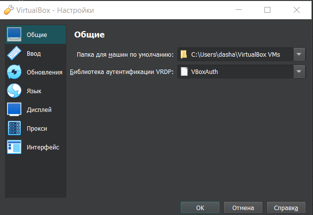{#fig:001 width=70%}

## Выполнение индивидуального проекта

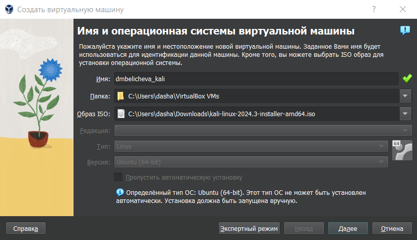{#fig:002 width=70%}

## Выполнение индивидуального проекта

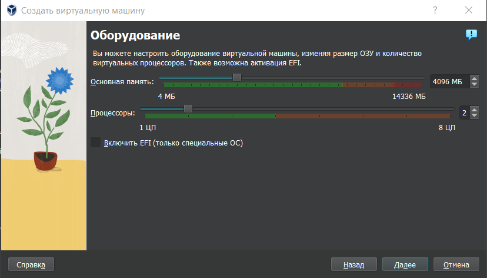{#fig:003 width=70%}

## Выполнение индивидуального проекта

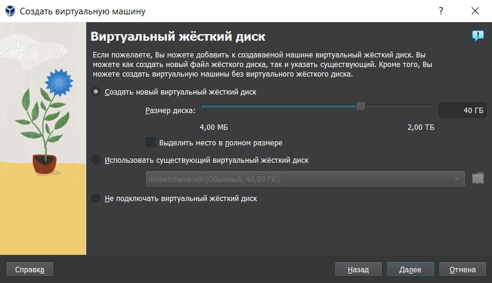{#fig:004 width=70%}

## Выполнение индивидуального проекта

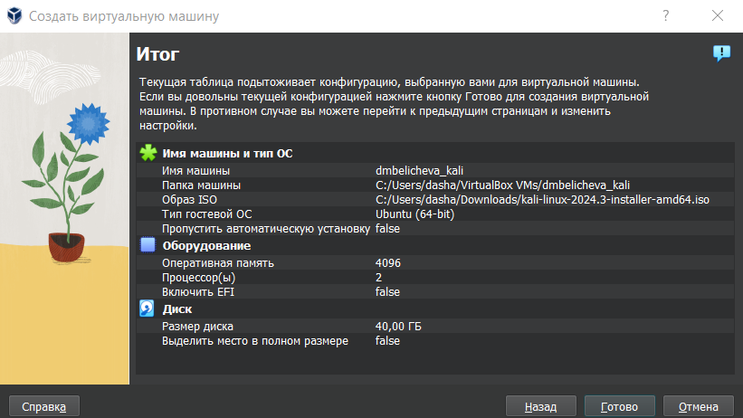{#fig:005 width=70%}

## Выполнение индивидуального проекта

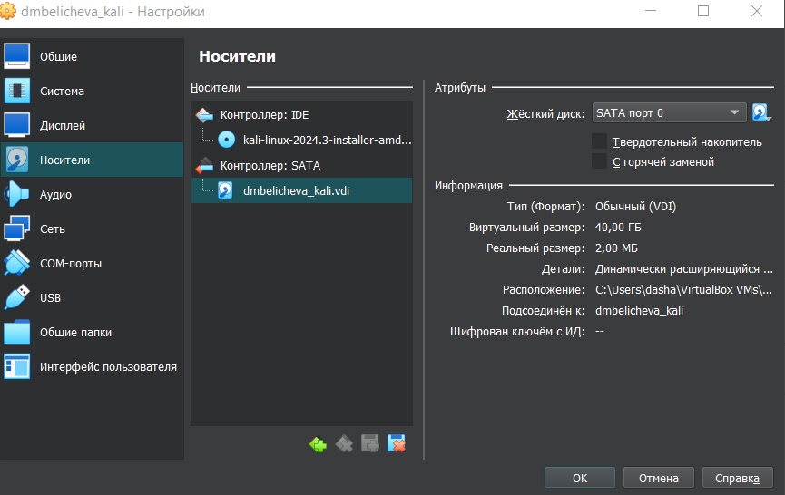{#fig:006 width=70%}

## Выполнение индивидуального проекта

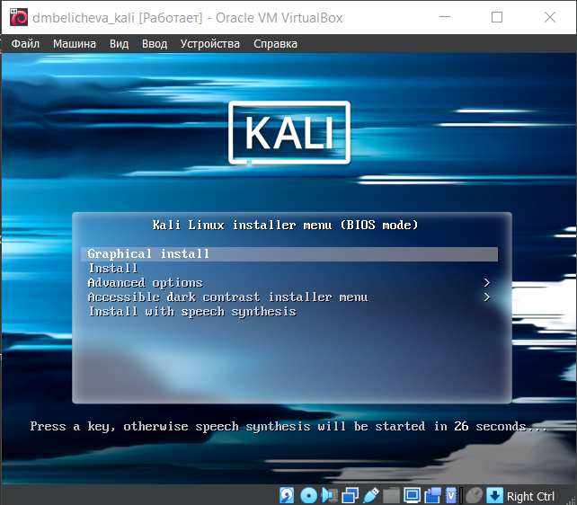{#fig:007 width=55%}

## Выполнение индивидуального проекта

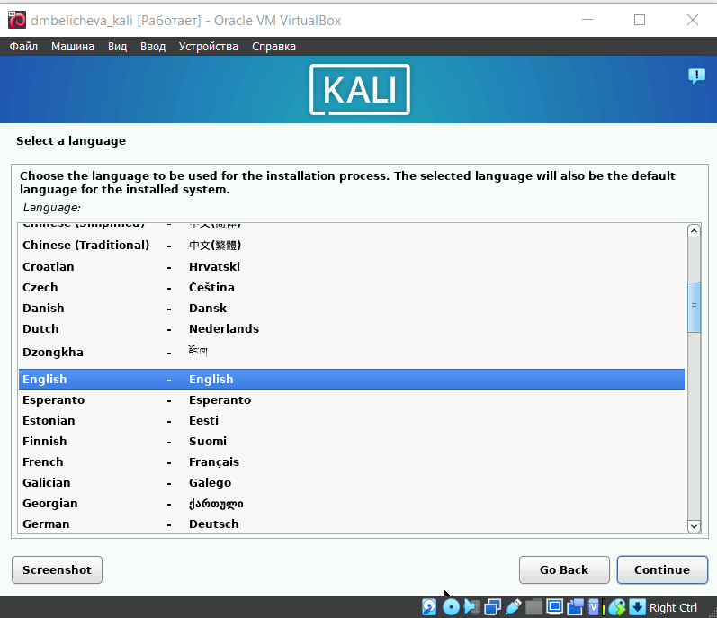{#fig:008 width=55%}

## Выполнение индивидуального проекта

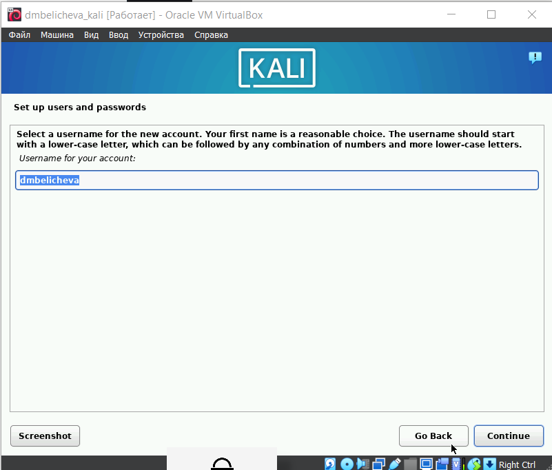{#fig:009 width=55%}

## Выполнение индивидуального проекта

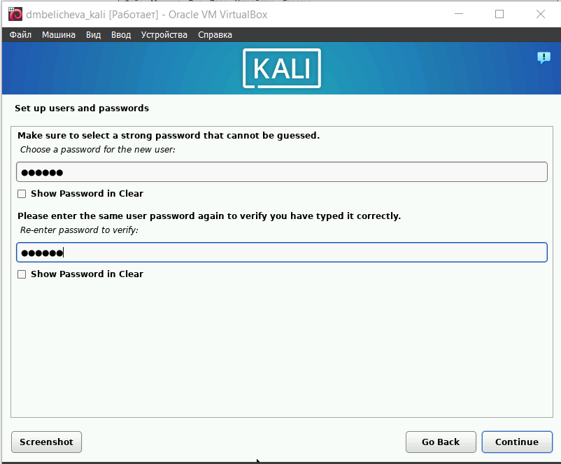{#fig:010 width=55%}

## Выполнение индивидуального проекта

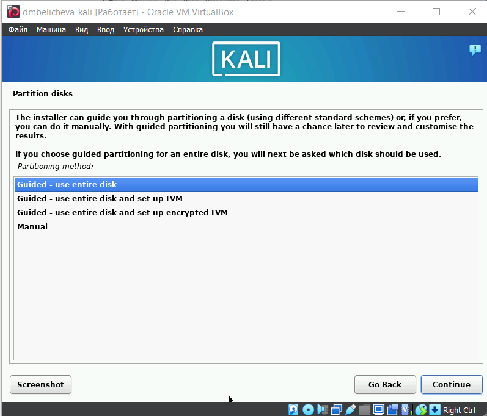{#fig:011 width=55%}

## Выполнение индивидуального проекта

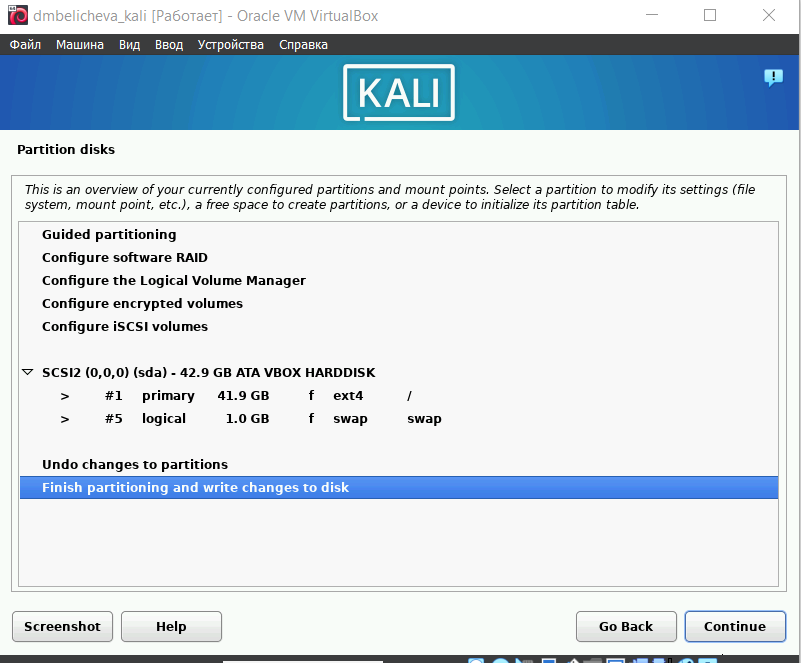{#fig:012 width=55%}

## Выполнение индивидуального проекта

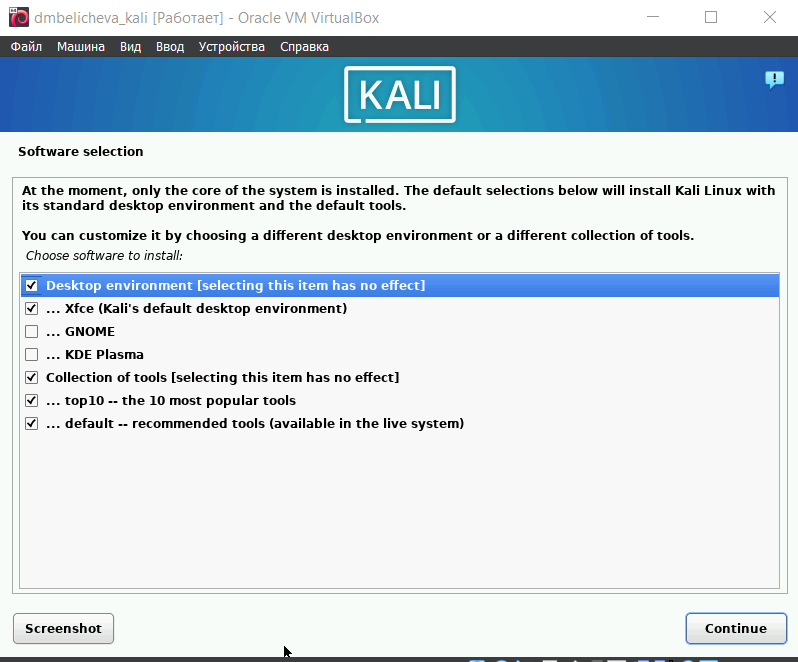{#fig:013 width=55%}

## Выполнение индивидуального проекта

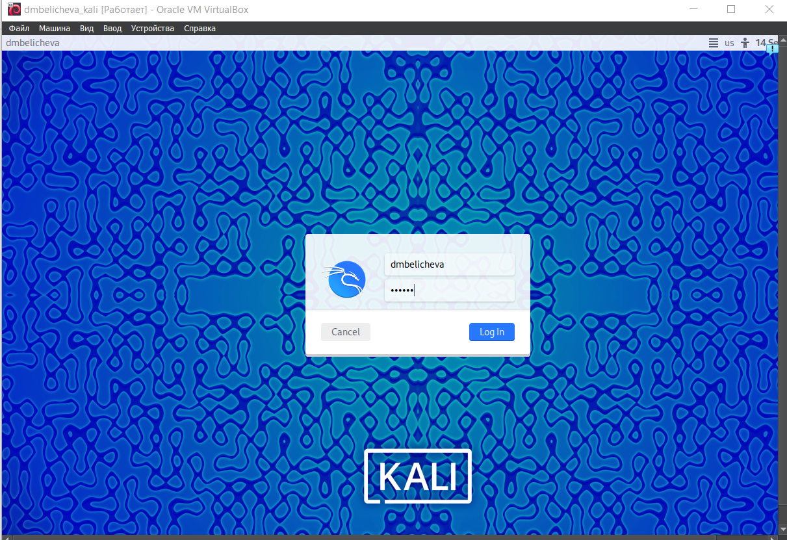{#fig:014 width=70%}

## Выполнение индивидуального проекта

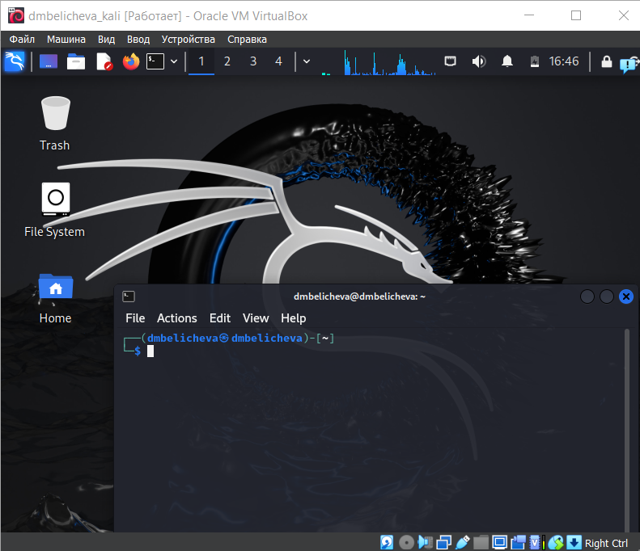{#fig:015 width=55%}

## Выводы

В результате выполнения первого этапа индивидуального проекта я установила дистрибутив Kali Linux в виртуальную машину.

## Список литературы

1. Kali Linux [Электронный ресурс]. Wikimedia Foundation, Inc., 2024. URL: https://ru.wikipedia.org/wiki/Kali_Linux.
2. Kali Linux [Электронный ресурс]. 2024. URL: https://www.kali.org/get-kali/#kali-platforms.