---
## Front matter
title: "Первый этап индивидуального проекта"
subtitle: "Установка Kali Linux"
author: "Беличева Дарья Михайловна"

## Generic otions
lang: ru-RU
toc-title: "Содержание"

## Bibliography
bibliography: bib/cite.bib
csl: pandoc/csl/gost-r-7-0-5-2008-numeric.csl

## Pdf output format
toc: true # Table of contents
toc-depth: 2
lof: true # List of figures
lot: false # List of tables
fontsize: 12pt
linestretch: 1.5
papersize: a4
documentclass: scrreprt
## I18n polyglossia
polyglossia-lang:
  name: russian
  options:
	- spelling=modern
	- babelshorthands=true
polyglossia-otherlangs:
  name: english
## I18n babel
babel-lang: russian
babel-otherlangs: english
## Fonts
mainfont: PT Serif
romanfont: PT Serif
sansfont: PT Sans
monofont: PT Mono
mainfontoptions: Ligatures=TeX
romanfontoptions: Ligatures=TeX
sansfontoptions: Ligatures=TeX,Scale=MatchLowercase
monofontoptions: Scale=MatchLowercase,Scale=0.9
## Biblatex
biblatex: true
biblio-style: "gost-numeric"
biblatexoptions:
  - parentracker=true
  - backend=biber
  - hyperref=auto
  - language=auto
  - autolang=other*
  - citestyle=gost-numeric
## Pandoc-crossref LaTeX customization
figureTitle: "Рис."
tableTitle: "Таблица"
listingTitle: "Листинг"
lofTitle: "Список иллюстраций"
lotTitle: "Список таблиц"
lolTitle: "Листинги"
## Misc options
indent: true
header-includes:
  - \usepackage{indentfirst}
  - \usepackage{float} # keep figures where there are in the text
  - \floatplacement{figure}{H} # keep figures where there are in the text
---

# Цель работы

Установить дистрибутив Kali Linux в виртуальную машину.

# Теоретическое введение

Kali Linux — GNU/Linux-LiveCD, возникший как результат слияния WHAX и Auditor Security Collection. Проект создали Мати Ахарони (Mati Aharoni) и Макс Мозер (Max Moser). Предназначен прежде всего для проведения тестов на безопасность. Наследник развивавшегося до 2013 года на базе Knoppix дистрибутива BackTrack [@wiki,@doc].

# Выполнение индивидуального проекта

Проверим в свойствах VirtualBox месторасположение каталога
для виртуальных машин. Для этого в VirtualBox выберем Файл ->
Настройки, вкладка Общие. В поле Папка для машин (рис. [-@fig:001]) укажем `C:\Users\dasha\VirtualBox VMs`.

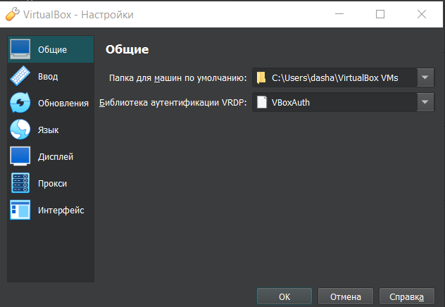{#fig:001 width=70%}

Создадим новую виртуальную машину. Для этого в VirtualBox выберем
Машина -> Создать; укажем имя виртуальной машины (dmbelicheva), тип
операционной системы -- Linux, Debian; укажем размер основной памяти виртуальной машины -- 4096
МБ и поставим 2 процессора; зададим размер диска -- 40 ГБ (рис. [-@fig:002]-[-@fig:005]).

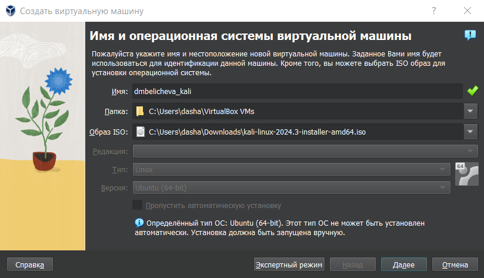{#fig:002 width=70%}

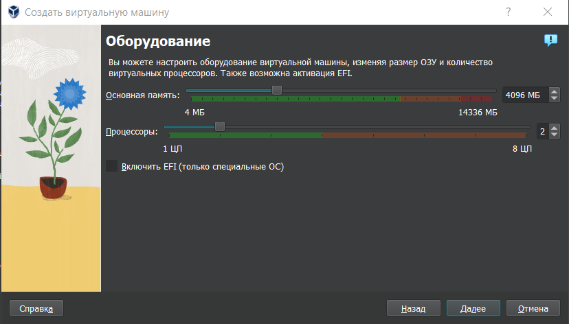{#fig:003 width=70%}

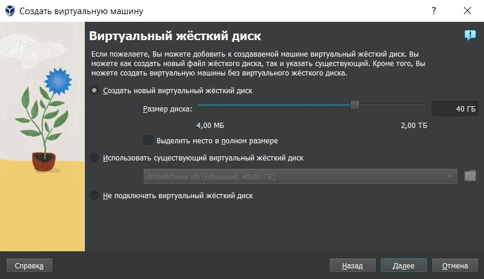{#fig:004 width=70%}

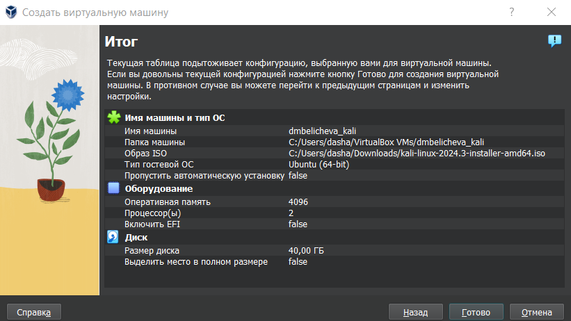{#fig:005 width=70%}

Выберем в VirtualBox для виртуальной машины Настройки ->
Носители. Проверим, что привод оптических дисков и образ операционной системы установлены правильно (рис. [-@fig:006]).

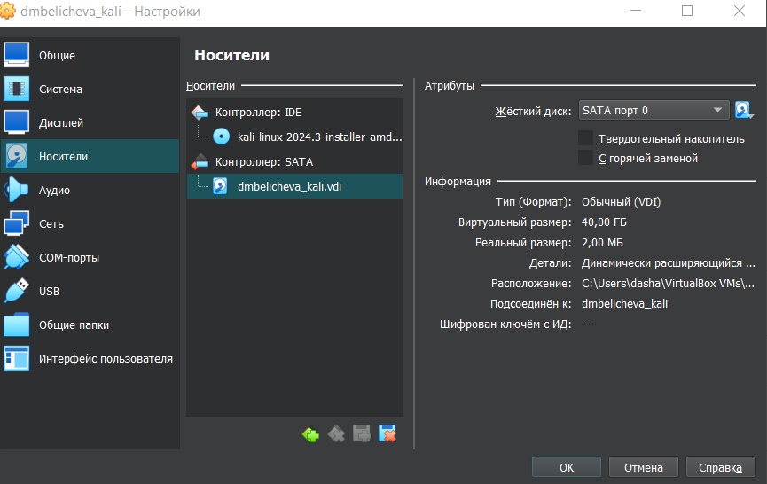{#fig:006 width=70%}

Запустим виртуальную машину, выберем English в качестве языка интерфейса (рис. [-@fig:007],[-@fig:008]).

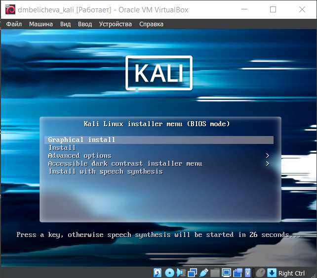{#fig:007 width=70%}

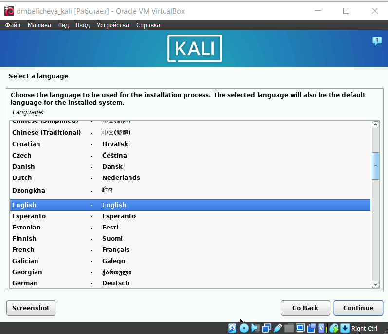{#fig:008 width=70%}

Теперь установим имя хоста, пользователя, пароль и перейдем к настройкам установки операционной
системы (рис. [-@fig:009]-[-@fig:0013]).

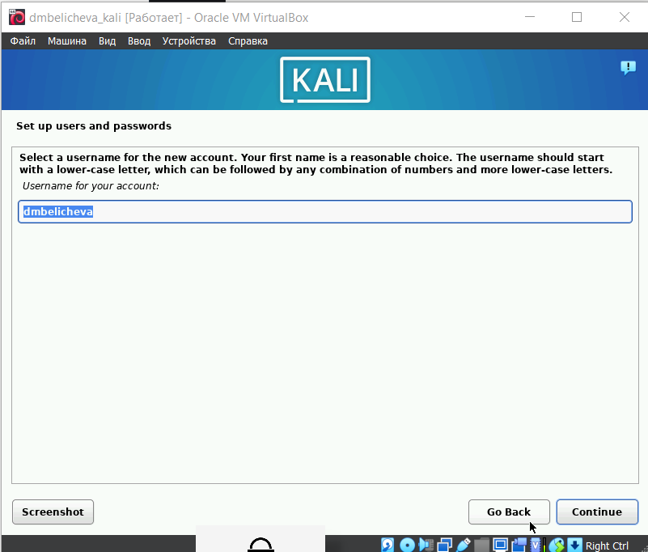{#fig:009 width=70%}

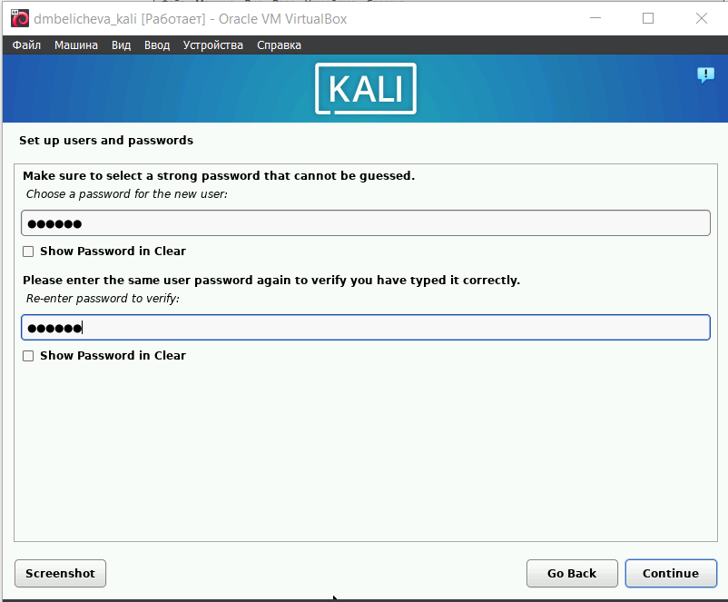{#fig:010 width=70%}

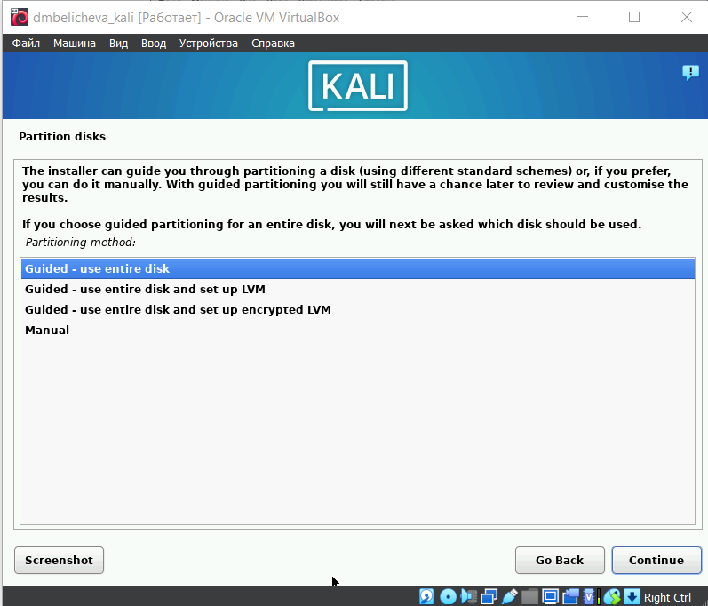{#fig:011 width=70%}

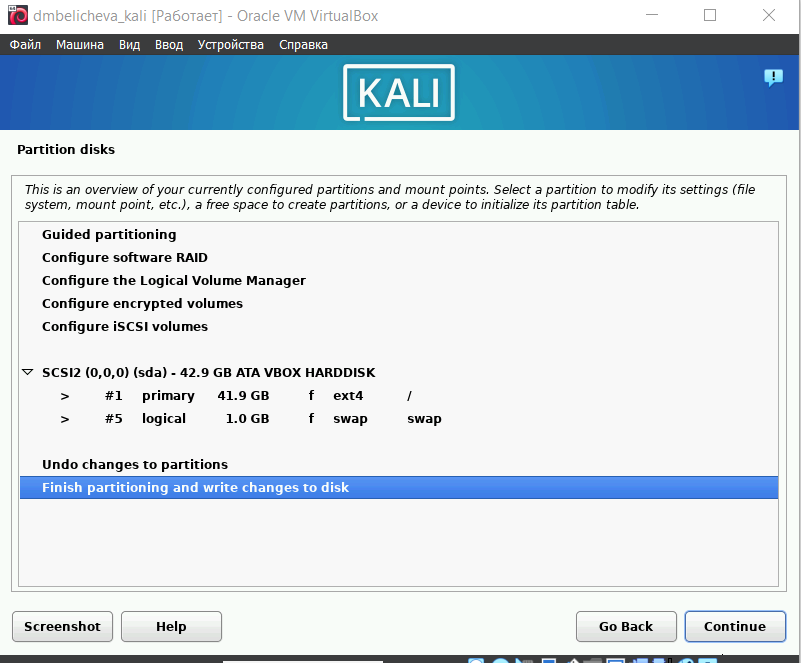{#fig:012 width=70%}

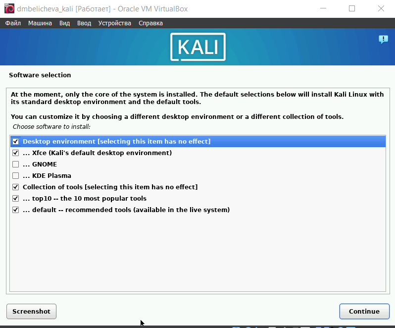{#fig:013 width=70%}

После завершения установки операционной системы корректно перезапустим виртуальную машину. Войдем в ОС под заданной при установке учётной записью (рис. [-@fig:014],[-@fig:015]).

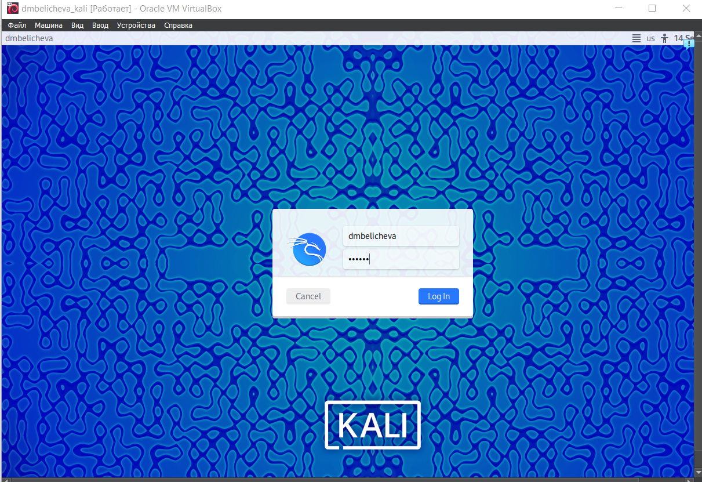{#fig:014 width=70%}

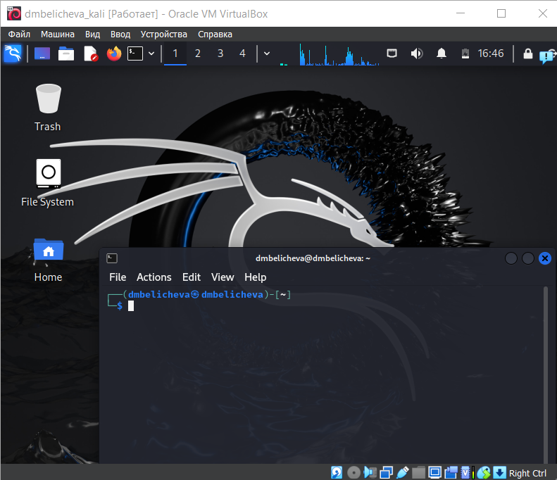{#fig:015 width=70%}

# Выводы

В результате выполнения первого этапа индивидуального проекта я установила дистрибутив Kali Linux в виртуальную машину.

# Список литературы{.unnumbered}

::: {#refs}
:::
