---
## Front matter
lang: ru-RU
title: Второй этап индивидуального проекта
subtitle: Установка DVWA
author:
  - Беличева Д. М.
institute:
  - Российский университет дружбы народов, Москва, Россия

## i18n babel
babel-lang: russian
babel-otherlangs: english

## Formatting pdf
toc: false
toc-title: Содержание
slide_level: 2
aspectratio: 169
section-titles: true
theme: metropolis
header-includes:
 - \metroset{progressbar=frametitle,sectionpage=progressbar,numbering=fraction}
 - '\makeatletter'
 - '\beamer@ignorenonframefalse'
 - '\makeatother'
---

# Информация

## Докладчик

:::::::::::::: {.columns align=center}
::: {.column width="70%"}

  * Беличева Дарья Михайловна
  * студентка
  * Российский университет дружбы народов
  * [1032216453@pfur.ru](mailto:1032216453@pfur.ru)
  * <https://dmbelicheva.github.io/ru/>

:::
::: {.column width="25%"}

:::
::::::::::::::

# Цель работы

Установить и настроить DVWA в гостевую систему к Kali Linux.

# Выполнение лабораторной работы

## Установка DVWA

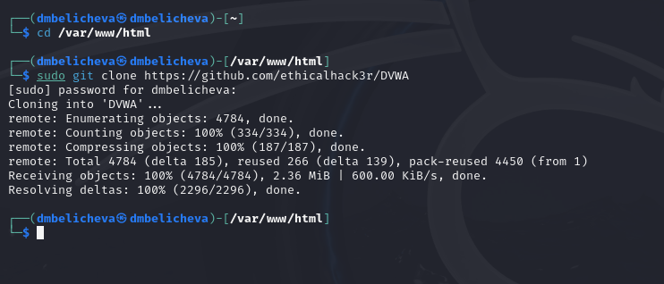{#fig:001 width=70%}

## Настройка DVWA

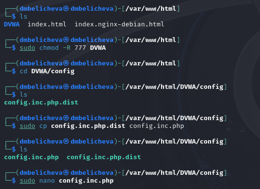{#fig:002 width=60%}

## Настройка DVWA

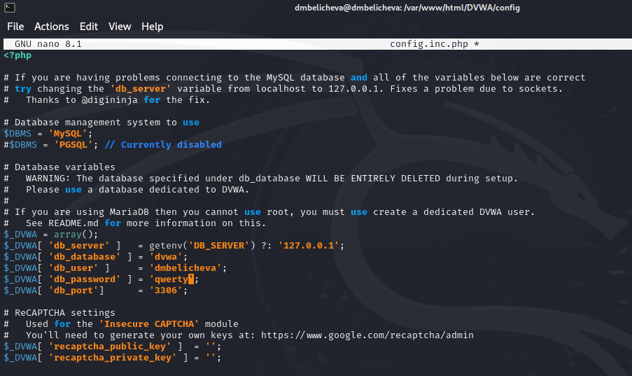{#fig:003 width=70%}

## Настройка базы данных

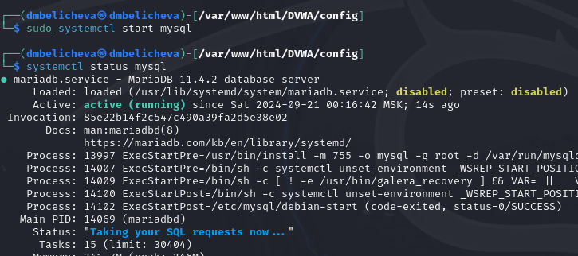{#fig:004 width=70%}

## Настройка базы данных

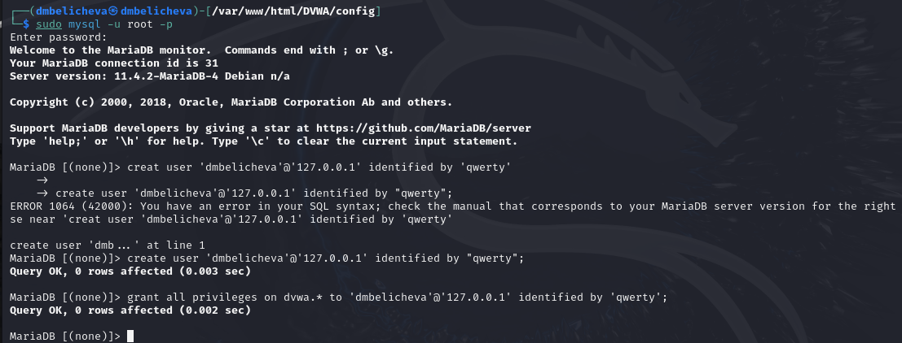{#fig:005 width=70%}

## Настройка сервера Apache

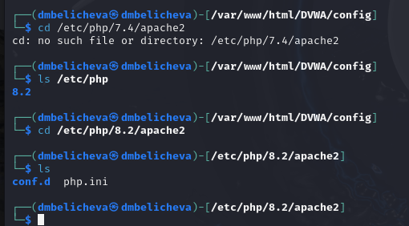{#fig:006 width=70%}

## Настройка сервера Apache

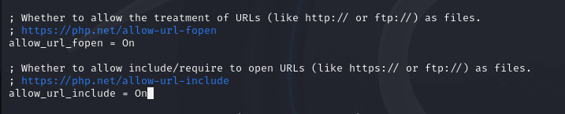{#fig:007 width=70%}

## Настройка сервера Apache

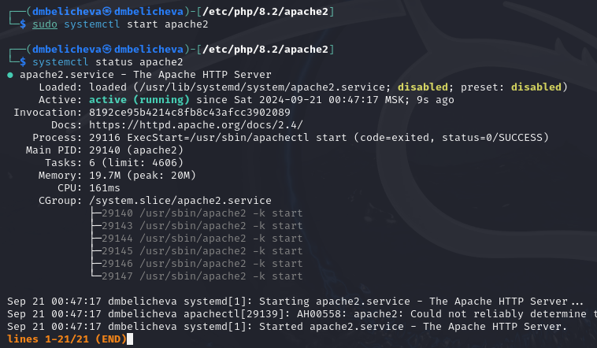{#fig:008 width=70%}

## Открытие DVWA в веб-браузере

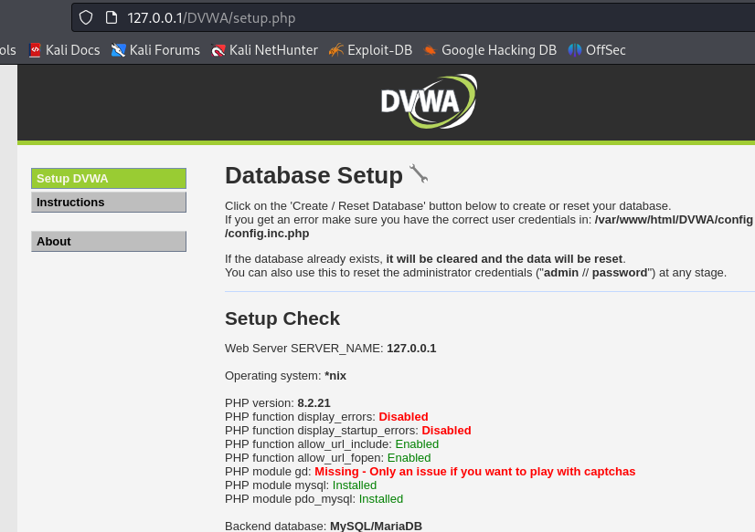{#fig:009 width=65%}

## Открытие DVWA в веб-браузере

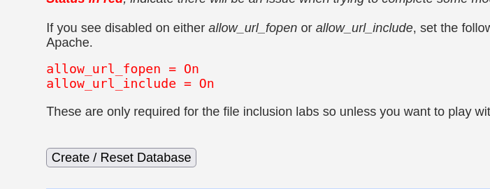{#fig:010 width=70%}

## Открытие DVWA в веб-браузере

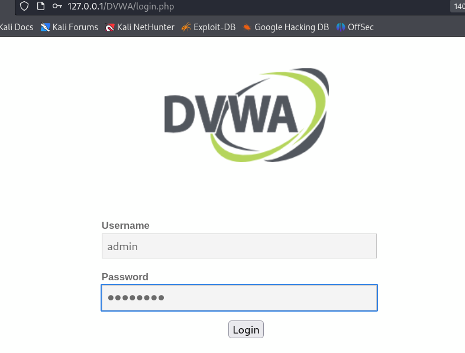{#fig:011 width=50%}

## Открытие DVWA в веб-браузере

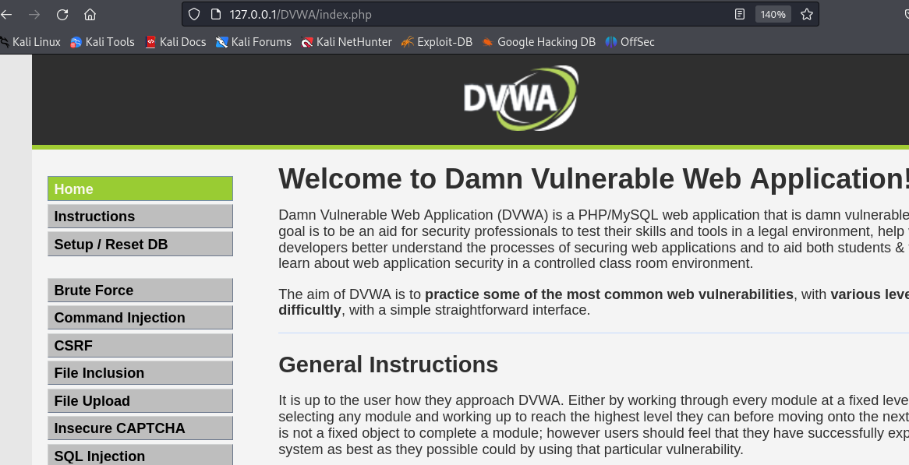{#fig:012 width=70%}

# Выводы

В результате выполнения данного этапа проекта я установила и настроила DVWA в гостевую систему к Kali Linux.

# Список литературы

1. Damn Vulnerable Web Application (DVWA) [Электронный ресурс]. 2024. URL:
https://kali.tools/?p=1820.