---
## Front matter
title: "Второй этап индивидуального проекта"
subtitle: "Установка DVWA"
author: "Беличева Дарья Михайловна"

## Generic otions
lang: ru-RU
toc-title: "Содержание"

## Bibliography
bibliography: bib/cite.bib
csl: pandoc/csl/gost-r-7-0-5-2008-numeric.csl

## Pdf output format
toc: true # Table of contents
toc-depth: 2
lof: true # List of figures
lot: false # List of tables
fontsize: 12pt
linestretch: 1.5
papersize: a4
documentclass: scrreprt
## I18n polyglossia
polyglossia-lang:
  name: russian
  options:
	- spelling=modern
	- babelshorthands=true
polyglossia-otherlangs:
  name: english
## I18n babel
babel-lang: russian
babel-otherlangs: english
## Fonts
mainfont: PT Serif
romanfont: PT Serif
sansfont: PT Sans
monofont: PT Mono
mainfontoptions: Ligatures=TeX
romanfontoptions: Ligatures=TeX
sansfontoptions: Ligatures=TeX,Scale=MatchLowercase
monofontoptions: Scale=MatchLowercase,Scale=0.9
## Biblatex
biblatex: true
biblio-style: "gost-numeric"
biblatexoptions:
  - parentracker=true
  - backend=biber
  - hyperref=auto
  - language=auto
  - autolang=other*
  - citestyle=gost-numeric
## Pandoc-crossref LaTeX customization
figureTitle: "Рис."
tableTitle: "Таблица"
listingTitle: "Листинг"
lofTitle: "Список иллюстраций"
lotTitle: "Список таблиц"
lolTitle: "Листинги"
## Misc options
indent: true
header-includes:
  - \usepackage{indentfirst}
  - \usepackage{float} # keep figures where there are in the text
  - \floatplacement{figure}{H} # keep figures where there are in the text
---

# Цель работы

Установить и настроить DVWA в гостевую систему к Kali Linux.

# Теоретическое введение

Damn Vulnerable Web Application (DVWA) — это веб-приложение на PHP/MySQL, которое чертовски уязвимо. Его главная цель — помочь профессионалам по безопасности протестировать их навыки и инструменты в легальном окружении, помочь веб-разработчикам лучше понять процесс безопасности веб-приложений и помочь и студентам и учителям в изучении безопасности веб-приложений в контролируем окружении аудитории [@dvwa].

Цель DVWA попрактиковаться в некоторых самых распространённых веб-уязвимостях, с различными уровнями сложности, с простым прямолинейном интерфейсом. Обратите внимание, что имеются как задокументированные, так и незадокументированные уязвимости в этом программном обеспечении. Это сделано специально. Вам предлагается попробовать и обнаружить так много уязвимостей, как сможете.

Некоторые из уязвимостей веб-приложений, который содержит DVWA:

- Брут-форс: Брут-форс HTTP формы страницы входа; используется для тестирования инструментов по атаке на пароль методом грубой силы и показывает небезопасность слабых паролей.

- Исполнение (внедрение) команд: Выполнение команд уровня операционной системы.

- Межсайтовая подделка запроса (CSRF): Позволяет «атакующему» изменить пароль администратора приложений.

- Внедрение (инклуд) файлов: Позволяет «атакующему» присоединить удалённые/локальные файлы в веб-приложение.

- SQL внедрение: Позволяет «атакующему» внедрить SQL выражения в HTTP из поля ввода, DVWA включает слепое и основанное на ошибке SQL внедрение.

- Небезопасная выгрузка файлов: Позволяет «атакующему» выгрузить вредоносные файлы на веб-сервер.

- Межсайтовый скриптинг (XSS): «Атакующий» может внедрить свои скрипты в веб-приложение/базу данных. DVWA включает отражённую и хранимую XSS.

- Пасхальные яйца: раскрытие полных путей, обход аутентификации и некоторые другие.

# Выполнение лабораторной работы

## Установка DVWA

Поскольку мы будем настраивать DVWA на нашем локальном хостинге, запустим терминал и перейдем в /var/www/html каталог. Это место, где хранятся файлы localhost. Далее мы клонируем репозиторий DVWA с GitHub в директорию /html (рис. [-@fig:001]).

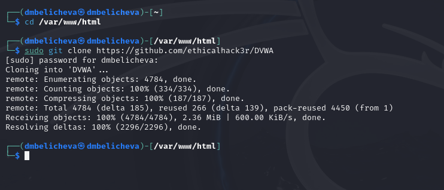{#fig:001 width=70%}

## Настройка DVWA

После успешного клонирования репозитория запустим команду `ls`, чтобы подтвердить, что DVWA был успешно клонирован. Теперь нам нужно назначить этой папке разрешения на чтение, запись и выполнение (777). Чтобы настроить DVWA, нам нужно будет перейти в каталог /dvwa/config. Запустим команду `ls`, чтобы просмотреть содержимое каталога конфигурации. Увидим файл с именем config.inc.php.dist. Этот файл содержит конфигурации DVWA по умолчанию.
Создадим копию этого файла с именем config.inc.php, который мы будем использовать для настройки DVWA (рис. [-@fig:002]).

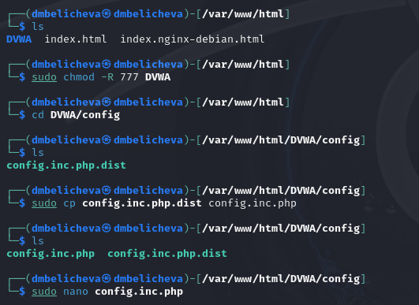{#fig:002 width=70%}

Теперь откроем config.inc.php файл с помощью nano редактора, чтобы произвести необходимые настройки.
Прокрутим вниз до того места, где находятся такие параметры, как db_database, db_user, db_password и т.д. Отредактируем эти значения (рис. [-@fig:003]).

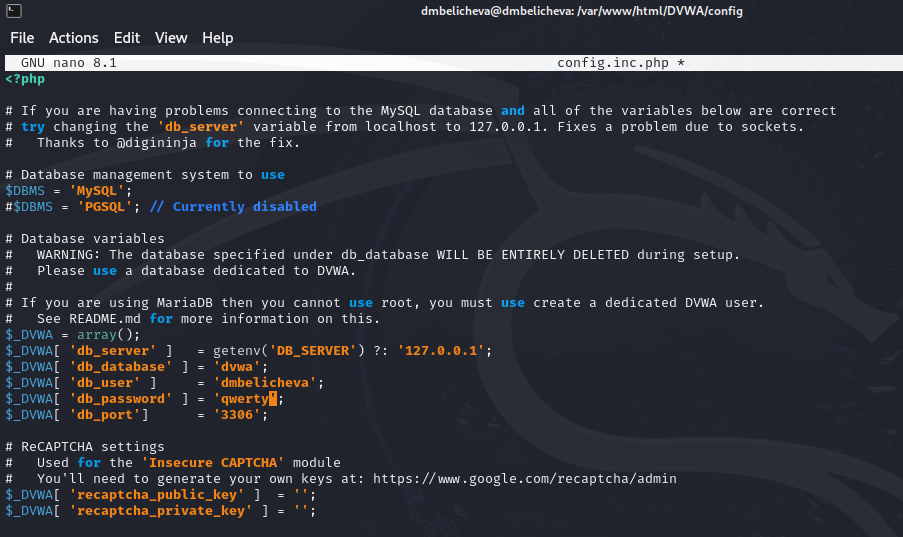{#fig:003 width=70%}

## Настройка базы данных

По умолчанию Kali Linux поставляется с системой управления реляционными базами данных MariaDB. Следовательно,не нужно устанавливать никаких пакетов. Сначала запустим службу mysql. 

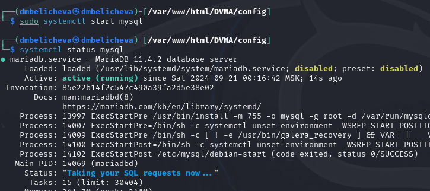{#fig:004 width=70%}

Войдем в базу данных. Создадим нового пользователя, используя учетные данные, которые мы установили в config.inc.php файле в каталоге DVWA.

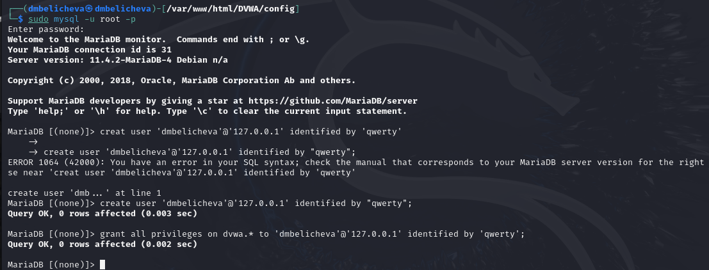{#fig:005 width=70%}

## Настройка сервера Apache

Веб-сервер Apache по умолчанию установлен в Kali Linux. Следовательно, нам не нужно устанавливать никаких дополнительных пакетов.

Чтобы приступить к настройке Apache2, запустим терминал и перейдем в /etc/php/7.4/apache2 каталог.
При выполнении команды `ls` увидим файл с именем php.ini. 

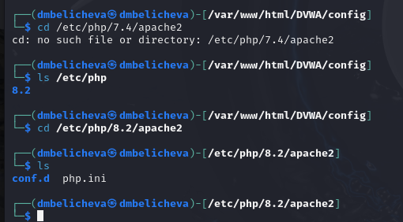{#fig:006 width=70%}

Откроем файл на редактирование. Прокрутим и найдем строки allow_url_fopen и allow_url_include, убедитесь, что для обеих установлено значение On.

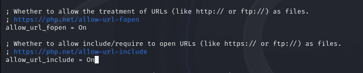{#fig:007 width=70%}

Перейдем к запуску службы веб-сервера apache. Можно проверить, запущена ли служба, выполнив команду `status`.

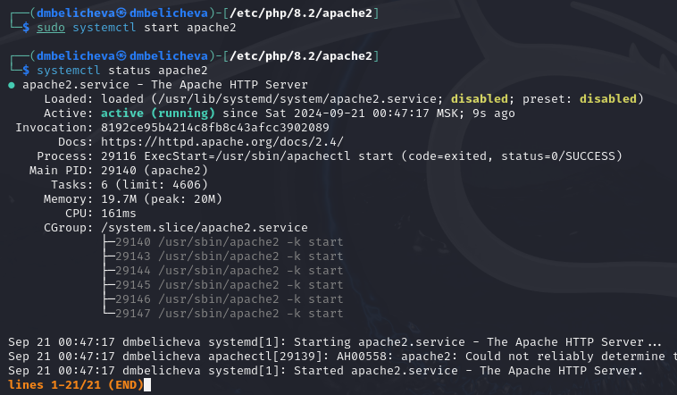{#fig:008 width=70%}

## Открытие DVWA в веб-браузере

На данный момент мы настроили DVWA, базу данных и веб-сервер Apache.

Теперь мы можем приступить к запуску приложения DVWA. Запустим свой веб-браузер и введем URL-адрес.

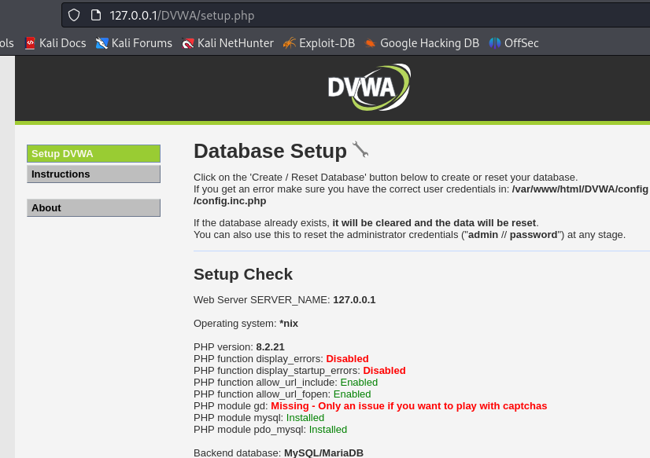{#fig:009 width=70%}

Нажмем кнопку Создать / Сбросить базу данных в конце страницы. Это создаст и настроит базу данных DVWA. Через несколько секунд мы будем перенаправлены на страницу входа в DVWA.

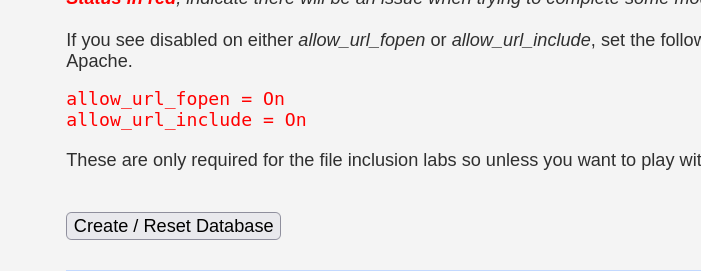{#fig:010 width=70%}

Используем приведенные ниже учетные данные по умолчанию для входа в систему.

Имя пользователя: admin

Пароль: пароль

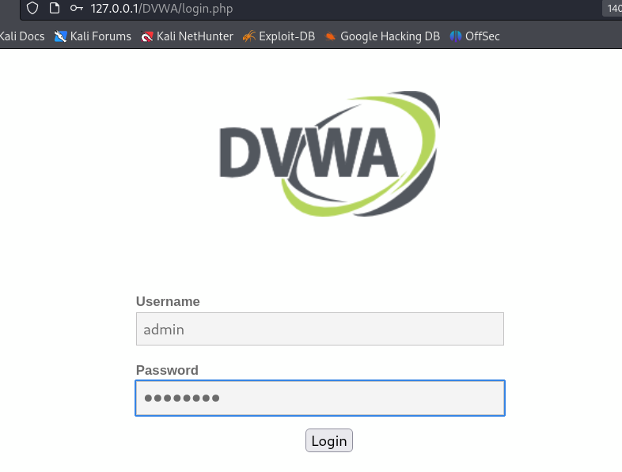{#fig:011 width=70%}

После успешного входа в систему увидим домашнюю страницу DVWA. В левой части увидим все доступные уязвимые страницы, которые можно использовать для практики.

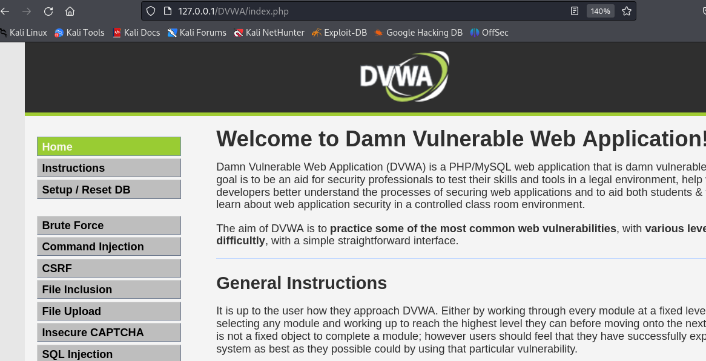{#fig:012 width=70%}

# Выводы

В результате выполнения данного этапа проекта я установила и настроила DVWA в гостевую систему к Kali Linux.

# Список литературы{.unnumbered}

::: {#refs}
:::
