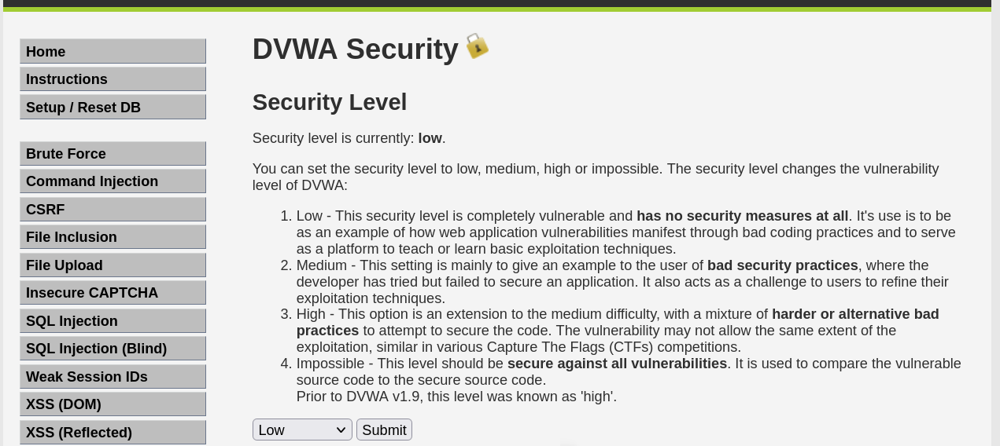
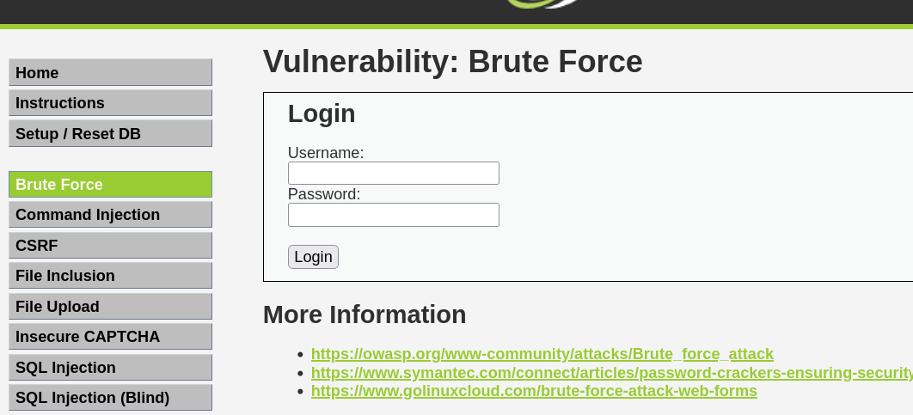
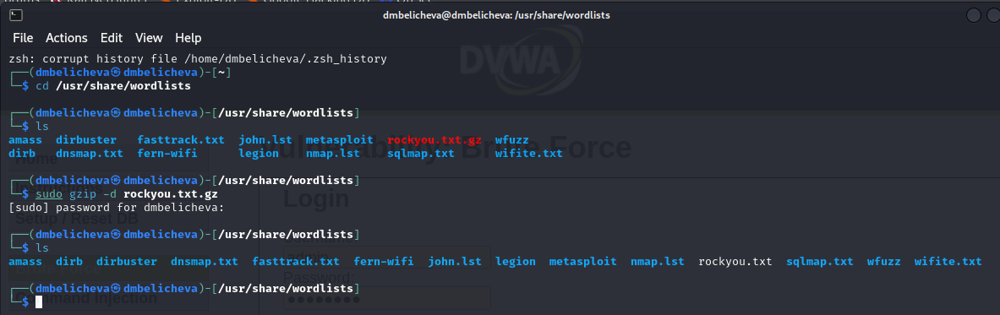
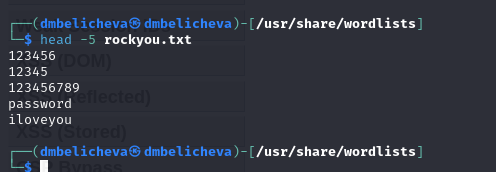
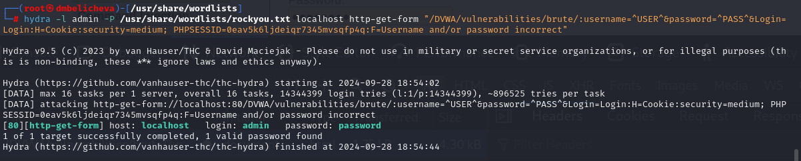
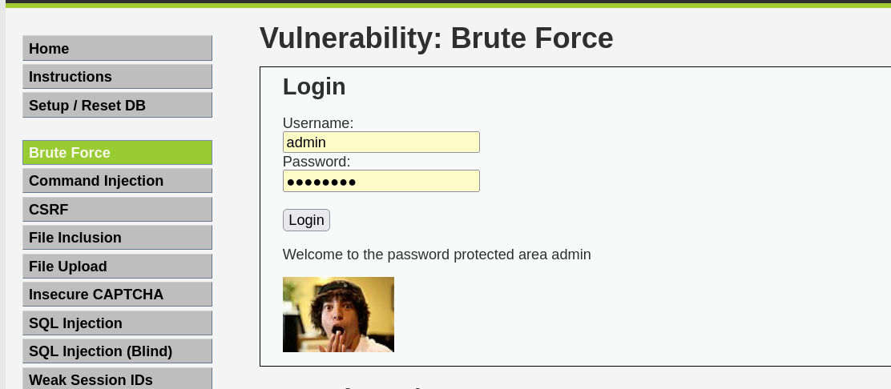

---
## Front matter
title: "Третий этап индивидуального проекта"
subtitle: "Использование Hydra"
author: "Беличева Дарья Михайловна"

## Generic otions
lang: ru-RU
toc-title: "Содержание"

## Bibliography
bibliography: bib/cite.bib
csl: pandoc/csl/gost-r-7-0-5-2008-numeric.csl

## Pdf output format
toc: true # Table of contents
toc-depth: 2
lof: true # List of figures
lot: false # List of tables
fontsize: 12pt
linestretch: 1.5
papersize: a4
documentclass: scrreprt
## I18n polyglossia
polyglossia-lang:
  name: russian
  options:
	- spelling=modern
	- babelshorthands=true
polyglossia-otherlangs:
  name: english
## I18n babel
babel-lang: russian
babel-otherlangs: english
## Fonts
mainfont: PT Serif
romanfont: PT Serif
sansfont: PT Sans
monofont: PT Mono
mainfontoptions: Ligatures=TeX
romanfontoptions: Ligatures=TeX
sansfontoptions: Ligatures=TeX,Scale=MatchLowercase
monofontoptions: Scale=MatchLowercase,Scale=0.9
## Biblatex
biblatex: true
biblio-style: "gost-numeric"
biblatexoptions:
  - parentracker=true
  - backend=biber
  - hyperref=auto
  - language=auto
  - autolang=other*
  - citestyle=gost-numeric
## Pandoc-crossref LaTeX customization
figureTitle: "Рис."
tableTitle: "Таблица"
listingTitle: "Листинг"
lofTitle: "Список иллюстраций"
lotTitle: "Список таблиц"
lolTitle: "Листинги"
## Misc options
indent: true
header-includes:
  - \usepackage{indentfirst}
  - \usepackage{float} # keep figures where there are in the text
  - \floatplacement{figure}{H} # keep figures where there are in the text
---

# Цель работы

Научиться использовать Hydra для подбора пароля (брутфорсинга).

# Теоретическое введение

Hydra -- распараллеленный сетевой взломщик входа, встроенный в различные операционные системы, такие как Kali Linux, Parrot и другие основные среды тестирования на проникновение. Hydra работает, используя различные подходы для выполнения атак методом перебора, чтобы угадать правильную комбинацию имени пользователя и пароля. Hydra обычно используется тестировщиками на проникновение вместе с набором программ, таких как crunch, cupp и т.д., которые используются для генерации списков слов. Затем Hydra используется для тестирования атак с использованием списков слов, созданных этими программами[@hydra].

- Hydra используется для подбора или взлома имени пользователя и пароля.
- Поддерживает подбор для большого набора приложений.

Пример работы:

- Исходные данные:
 - IP сервера 178.72.90.181;
 - Сервис http на стандартном 80 порту;
 - Для авторизации используется html форма, которая отправляет по адресу http://178.72.90.181/cgi-bin/luci методом POST запрос вида username=root&password=test_password;
 - В случае не удачной аутентификации пользователь наблюдает сообщение Invalid username and/or password! Please try again.

Запрос к Hydra будет выглядеть примерно так:

`hydra -l root -P ~/pass_lists/dedik_passes.txt -o ./hydra_result.log -f -V -s 80 178.72.90.181 http-post-form "/cgi-bin/luci:username=^USER^&password=^PASS^:Invalid username"`

# Выполнение лабораторной работы

Запустим DVWA, перейдем к настройке уровня безопасности и выставим низкий уровень (рис. [-@fig:001]).

{#fig:001 width=70%}

Откроем страницу для проведения атаки brute force, которая представляет собой простейшую уязвимую форму с паролем (рис. [-@fig:002]).

{#fig:002 width=70%}

Для работы Hydra нам нужен список паролей. В Kali есть файл со списком популярных паролей, найдем его и распакуем (рис. [-@fig:003]).

{#fig:003 width=70%}

Посмотрим содержимое первых строк этого файла (рис. [-@fig:004]).

{#fig:004 width=70%}

С помощью горячей клавиши f12 на сайте DVWA откроем инструмент разработчика и посмотрим HTTP запросы, чтобы узнать необходимую нам информацию для атаки.

Исходные данные:

- IP сервера 127.0.0.1(localhost);
- Сервис http на стандартном 80 порту;
- Для авторизации используется html форма, которая отправляет по адресу http://localhost/DVWA/vulnerabilities/brute методом GET запрос вида username=admin&password=test_password;
- В случае неудачной аутентификации пользователь наблюдает сообщение Username and/or password incorrect.

Запрос к Hydra будет выглядеть так (рис. [-@fig:005]):

{#fig:005 width=70%}

Мы получили нужный нам пароль. Попробуем его ввести и получим успешный вход в систему (рис. [-@fig:006]).

{#fig:006 width=70%}

# Выводы

В процессе выполнения данной лабораторной работы я освоила навыки использования Hydra для подбора пароля (брутфорсинга).

# Список литературы{.unnumbered}

::: {#refs}
:::
