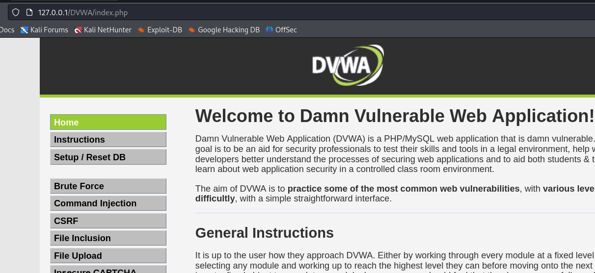
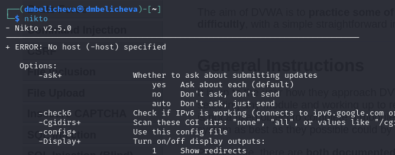
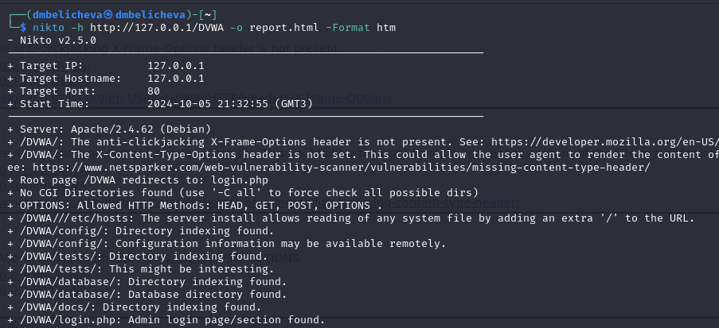
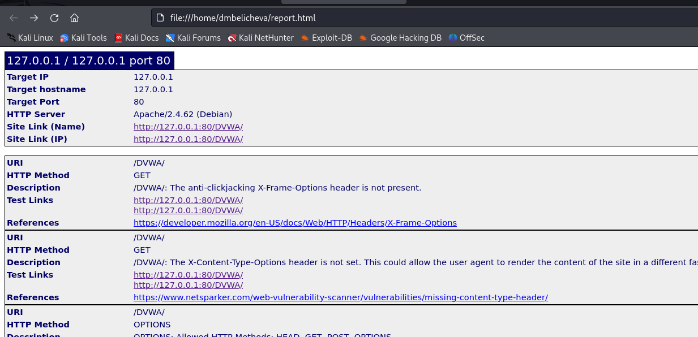
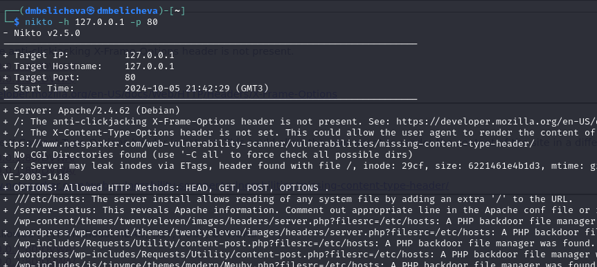

---
## Front matter
title: "Четвертый этап индивидуального проекта"
subtitle: "Использование nikto"
author: "Беличева Дарья Михайловна"

## Generic otions
lang: ru-RU
toc-title: "Содержание"

## Bibliography
bibliography: bib/cite.bib
csl: pandoc/csl/gost-r-7-0-5-2008-numeric.csl

## Pdf output format
toc: true # Table of contents
toc-depth: 2
lof: true # List of figures
lot: false # List of tables
fontsize: 12pt
linestretch: 1.5
papersize: a4
documentclass: scrreprt
## I18n polyglossia
polyglossia-lang:
  name: russian
  options:
	- spelling=modern
	- babelshorthands=true
polyglossia-otherlangs:
  name: english
## I18n babel
babel-lang: russian
babel-otherlangs: english
## Fonts
mainfont: PT Serif
romanfont: PT Serif
sansfont: PT Sans
monofont: PT Mono
mainfontoptions: Ligatures=TeX
romanfontoptions: Ligatures=TeX
sansfontoptions: Ligatures=TeX,Scale=MatchLowercase
monofontoptions: Scale=MatchLowercase,Scale=0.9
## Biblatex
biblatex: true
biblio-style: "gost-numeric"
biblatexoptions:
  - parentracker=true
  - backend=biber
  - hyperref=auto
  - language=auto
  - autolang=other*
  - citestyle=gost-numeric
## Pandoc-crossref LaTeX customization
figureTitle: "Рис."
tableTitle: "Таблица"
listingTitle: "Листинг"
lofTitle: "Список иллюстраций"
lotTitle: "Список таблиц"
lolTitle: "Листинги"
## Misc options
indent: true
header-includes:
  - \usepackage{indentfirst}
  - \usepackage{float} # keep figures where there are in the text
  - \floatplacement{figure}{H} # keep figures where there are in the text
---

# Цель работы

Целью данной работы является использование Nikto для сканирования уязвимостей веб-приложения.

# Теоретическое введение

nikto — базовый сканер безопасности веб-сервера. Он сканирует и обнаруживает уязвимости в веб-приложениях, обычно вызванные неправильной конфигурацией на самом сервере, файлами, установленными по умолчанию, и небезопасными файлами, а также устаревшими серверными приложениями.

В начале сканирования всегда отображается следующий блок с информацией[@nikto]:

- Target IP: IP адрес сканируемого домена;
- Target Hostname: имя хоста (доменное имя) сканируемого сайта;
- Target Port: порт, на котором находится сайт;
- Start Time: дата и время начала сканирования в формате год-месяц-день час:минута:секунда.

Вывод результатов сканирования имеет несколько форматов:

1. Формат: Тип компонента сайта: Наименование компонента. Пример: Server: nginx.
2. Описание: Nikto умеет определять, какие компоненты использует сайт. Сюда относят наименование веб-сервера, используемой СУБД, фреймворков, языков программирования, а также их версии. Формат: путь до файла/директории, где найдена уязвимость: описание уязвимости. Пример: /phpinfo.php: Output from the phpinfo() function was found.

# Выполнение лабораторной работы

Будем проверять работу nikto на веб-приложении DVWA. Для этого запустим mysql и apache2 (рис. [-@fig:001]).

{#fig:001 width=70%}

Теперь можем в адресной строке открыть DVWA (рис. [-@fig:002]).

{#fig:002 width=70%}

Теперь проверим, что nikto установлен (рис. [-@fig:003]).

{#fig:003 width=70%}

Теперь можем проверить сайт DVWA. Минимальный синтаксис для запуска сканирования выглядит следующим образом:

`nikto -h доменное_имя или IP_адрес`

Параметр `-h` обязателен к использованию, иначе программа не сможет запустить сканирование (рис. [-@fig:004]).
Чтобы получить отчет в удобном формате, можно использовать опцию `Format`. Я указала формат html.

{#fig:004 width=70%}

Получаем следующий отчет (рис. [-@fig:005]).

{#fig:005 width=70%}

Можем увидеть, что найдены такие уязвимости как отсутствие защиты от кликджекинга, не установлен заголовок X-Content-Type-Options(в связи с чем пользователь может выполнить вредоносный контент не того типа, который предполагает администратор), возможность удаленного доступа к файлам конфигураций, также найдена скрытая папка git, в которой хранятся данные о структуре сайта. Уязвимость типа `This might be interesting...` означает, что необходимо дополнительная ручная проверка(скорей всего это незначительная уязвимость раскрытия информации -- доступен просмотр файлов каталога). В конце отчета указано, что найдено 26 уязвимостей.

Также можно посмотреть информацию об уязвимостях по конкретному порту (в нашем случае порт 80 для локального хоста) (рис. [-@fig:006]).

{#fig:006 width=70%}

# Выводы

В результате выполнения работы был использован сканер Nikto для сканирования уязвимостей веб-приложения.

# Список литературы{.unnumbered}

::: {#refs}
:::
