---
## Front matter
title: "Пятый этап индивидуального проекта"
subtitle: "Использование Burp Suite"
author: "Беличева Дарья Михайловна"

## Generic otions
lang: ru-RU
toc-title: "Содержание"

## Bibliography
bibliography: bib/cite.bib
csl: pandoc/csl/gost-r-7-0-5-2008-numeric.csl

## Pdf output format
toc: true # Table of contents
toc-depth: 2
lof: true # List of figures
lot: false # List of tables
fontsize: 12pt
linestretch: 1.5
papersize: a4
documentclass: scrreprt
## I18n polyglossia
polyglossia-lang:
  name: russian
  options:
	- spelling=modern
	- babelshorthands=true
polyglossia-otherlangs:
  name: english
## I18n babel
babel-lang: russian
babel-otherlangs: english
## Fonts
mainfont: PT Serif
romanfont: PT Serif
sansfont: PT Sans
monofont: PT Mono
mainfontoptions: Ligatures=TeX
romanfontoptions: Ligatures=TeX
sansfontoptions: Ligatures=TeX,Scale=MatchLowercase
monofontoptions: Scale=MatchLowercase,Scale=0.9
## Biblatex
biblatex: true
biblio-style: "gost-numeric"
biblatexoptions:
  - parentracker=true
  - backend=biber
  - hyperref=auto
  - language=auto
  - autolang=other*
  - citestyle=gost-numeric
## Pandoc-crossref LaTeX customization
figureTitle: "Рис."
tableTitle: "Таблица"
listingTitle: "Листинг"
lofTitle: "Список иллюстраций"
lotTitle: "Список таблиц"
lolTitle: "Листинги"
## Misc options
indent: true
header-includes:
  - \usepackage{indentfirst}
  - \usepackage{float} # keep figures where there are in the text
  - \floatplacement{figure}{H} # keep figures where there are in the text
---

# Цель работы

Освоить навыки использования Burp Suite.

# Теоретическое введение

Burp Suite -- это платформа для выполнения тестирования по безопасности веб-приложений. В этой заметке я поделюсь несколькими приёмами, как использовать данный инструмент более эффективно[@habr].

Пакет состоит из набора утилит, среди которых есть инструменты для сбора и анализа информации, моделирования разных типов атак, перехвата запросов и ответов сервера и так далее.

- Target -- создает карту сайта с подробной информацией о тестируемом приложении. Показывает, какие цели находятся в процессе тестирования, и позволяет управлять процессом обнаружения уязвимостей.
- Proxy -- находится между браузером пользователя и тестируемым веб-приложением. Перехватывает все сообщения, передаваемые по протоколу HTTP(S).
- Spider -- автоматически собирает данные о функциях и компонентах веб-приложения. 
- Clickbandit -- моделирует кликджекинг-атаки (clickjacking attacks), при которых поверх страницы приложения загружается невидимая страница, подготовленная злоумышленниками.
- DOM Invader -- проверяет веб-приложение на уязвимость DOM-based межсайтовому скриптингу ( основанномуна объектной модели документа), внедрению вредоносного кода на страницу.
- Scanner (в профессиональной и корпоративной редакциях) — автоматически сканирует уязвимости в веб-приложениях. Также существует в бесплатной версии, но, предоставляет только описание возможностей.
Intruder -- проводит автоматические атаки различного типа, от перебора открытых веб-директорий до внедрения SQL-кода.
- Repeater -- утилита для ручного манипулирования и повторной выдачи отдельных HTTP-запросов и анализа ответов приложения. Отправить запрос в Repeater можно из любой другой утилиты Burp Suite.
- Sequencer -- анализирует качество случайности в выборке элементов данных. Можно использовать для тестирования сеансовых маркеров приложения или других важных элементов данных, которые должны быть непредсказуемыми, например маркеров анти-CSRF, маркеров сброса пароля и так далее.
Decoder--— преобразовывает закодированные данные в исходную форму или необработанные в различные закодированные и хешированные формы. Способен распознавать несколько форматов кодирования, используя эвристические методы.
Comparer -- предоставляет функцию визуального сравнения различий данных.

# Выполнение лабораторной работы

Скачаем Burp Suite с официального сайта  (рис. [-@fig:001]).

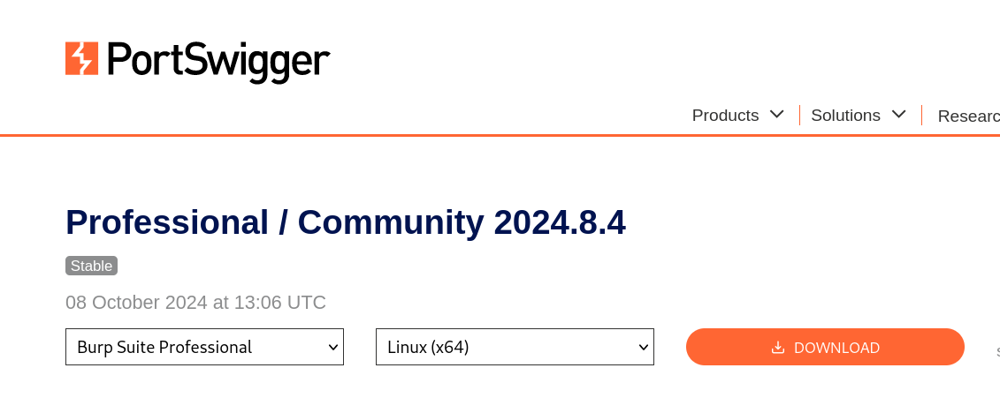{#fig:001 width=70%}

Далее сделаем скачанный файл исполняемым и запустим его (рис. [-@fig:002]).

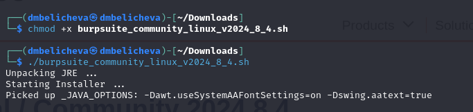{#fig:002 width=70%}

После того, как мы открыли Burp Suite идет первоначальная настройка программы. В первом окне выберем "Temponary project" (рис. [-@fig:003]).

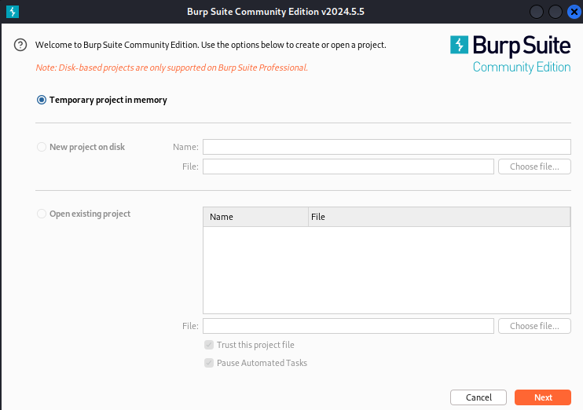{#fig:003 width=70%}

Затем выберите "Use Burp defaults" (рис. [-@fig:004]).

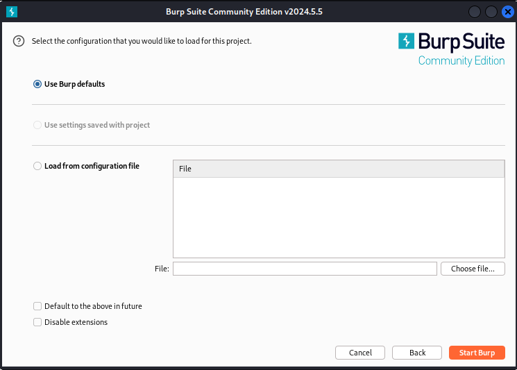{#fig:004 width=70%}

Когда вы пропускаете запросы к сайтам через прокси Burp Suite, то программа позволяет вам редактировать на лету любой из запросов или ответов, вы можете отслеживать все передаваемые заголовки и многое другое. Когда вы запускаете программу, прокси уже запущен, осталось только настроить браузер для работы с ним. Для этого перейдем в настройки прокси сервера в браузере и укажем там адрес прокси 127.0.0.1, а порт 8080 (рис. [-@fig:005]).

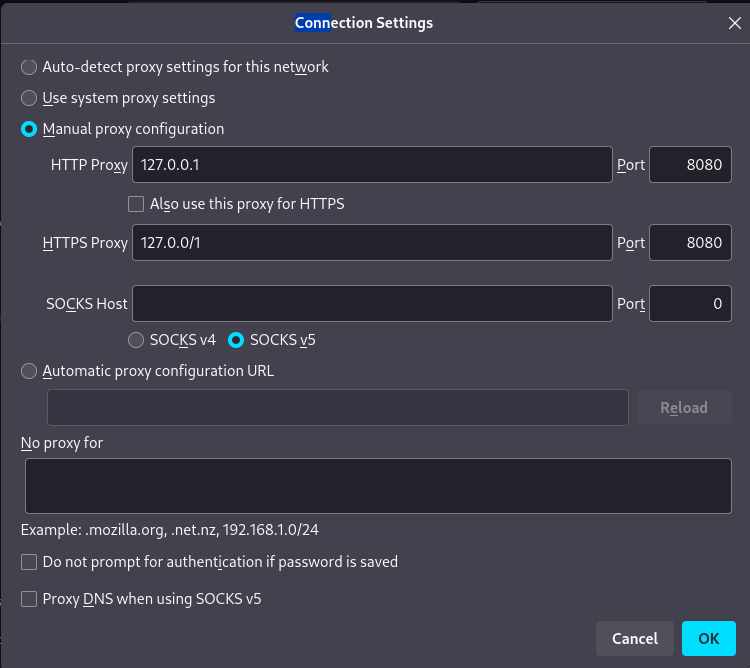{#fig:005 width=70%}

Чтобы Burp Suite исправно работал с локальным сервером, необходимо установить параметр `network_allow_hijacking_loacalhost` на `true` (рис. [-@fig:007]).

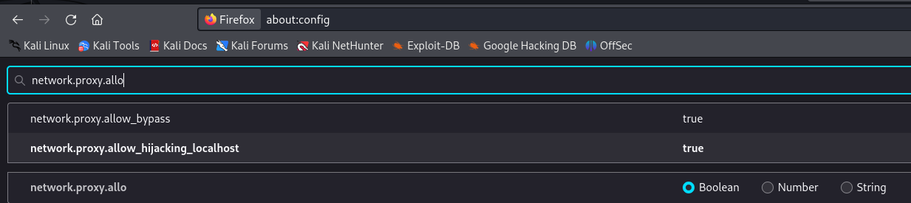{#fig:007 width=70%}

Возвращаясь к Burp Suit, во вкладке Proxy устанавливаем “Intercept is on”. Будем проверять работу Burp Suit на DVWA (предварительно запустив для него все сервисы). Вводим в браузере адрес DVWA. Чтобы запрос обработался нам надо выбрать запрос и нажать кнопку "Forward" в Burp Suit. Запрос успешно отправлен, и мы попали за страницу авторизации (рис. [-@fig:008]).

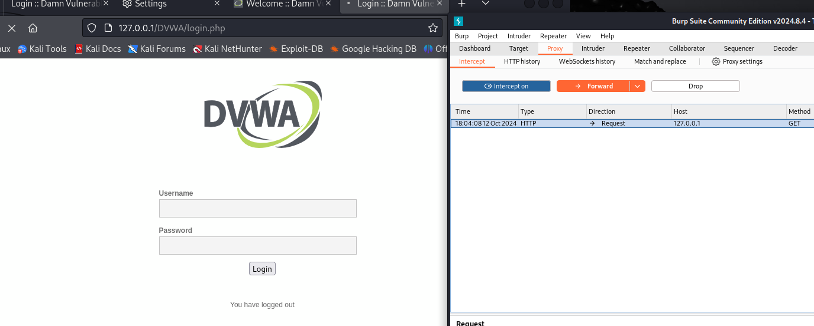{#fig:008 width=70%}

Можем также посмотреть http историю запросов (рис. [-@fig:009]).

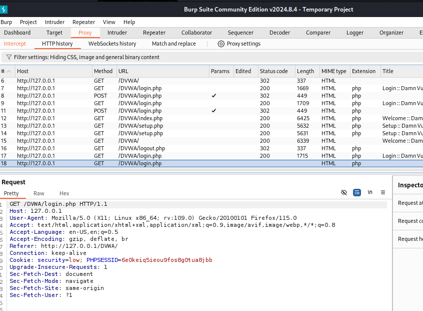{#fig:009 width=70%}

Попробуем авторизоваться с неправильными данными и посмотреть на запрос. Можно увидеть в POST-запросе логин и пароль, с которыми была попытка авторизоваться (рис. [-@fig:010]).

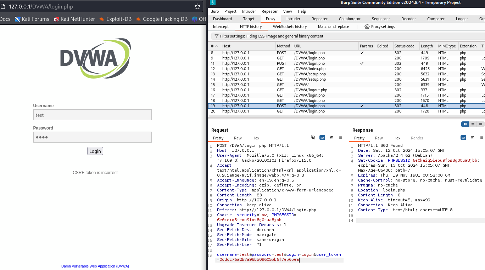{#fig:010 width=70%}

Отправим наш запрос к Intruder (рис. [-@fig:011]).

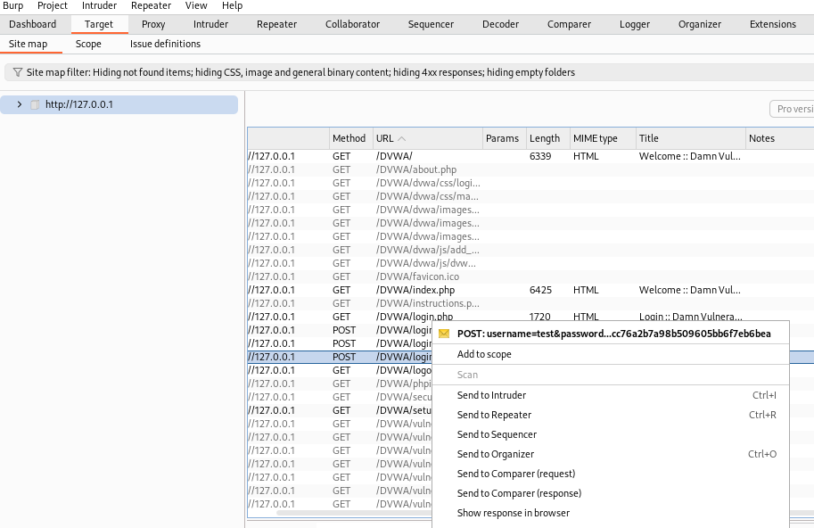{#fig:011 width=70%}

Здесь мы можем задать параметры атаки: ставим тип атаки Cluster bomb, оборачиваем логин и пароль в специальные символы (потому что подбирать будем их) (рис. [-@fig:013]).

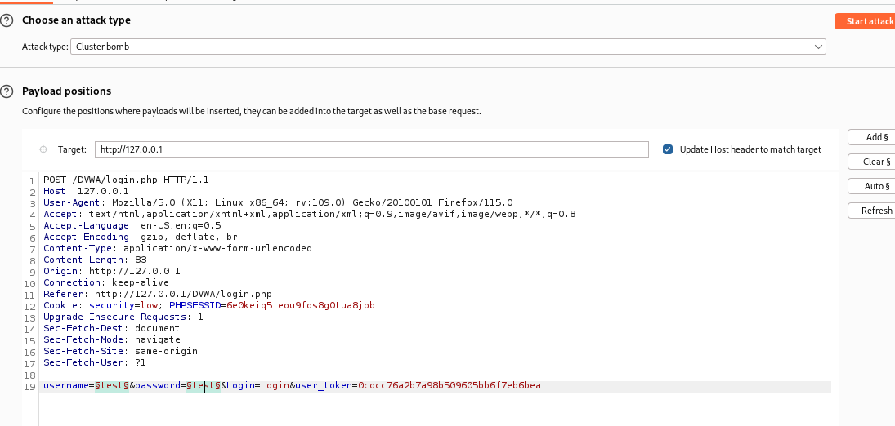{#fig:013 width=70%}

Переходим к заданию Simple list. У нас их будет два: для логина и для пароля. Мы просто вручную введем сюда рандомные данные, которые хотим проверить (не забудем ввести подходящий пароль) (рис. [-@fig:014];[-@fig:015]).

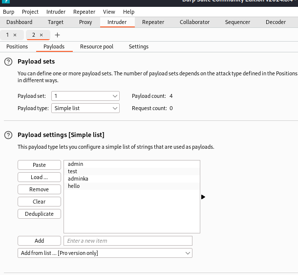{#fig:014 width=70%}

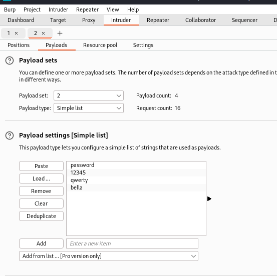{#fig:015 width=70%}

Запускаем атаку, нам вывелось 16 возможных вариантов с введенными мною логинами и паролями (рис. [-@fig:016]).

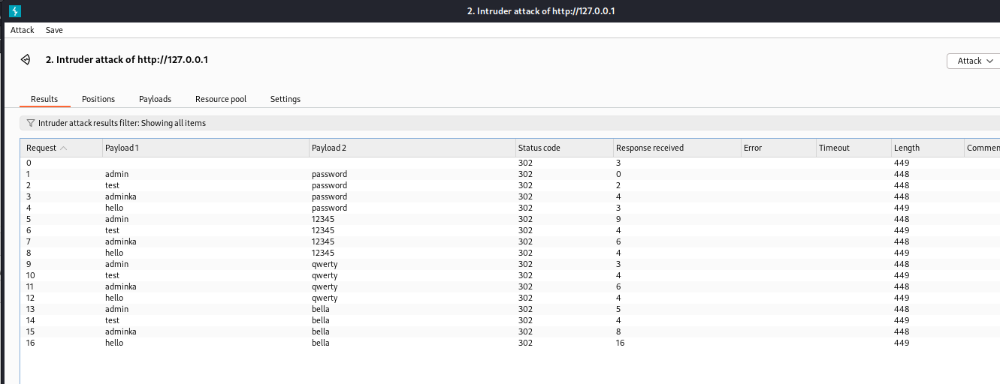{#fig:016 width=70%}

Посмотрим на ответ полученный с использованием неправильных данных. Увидим, что мы остались на странице авторизации login.php (рис. [-@fig:017]).

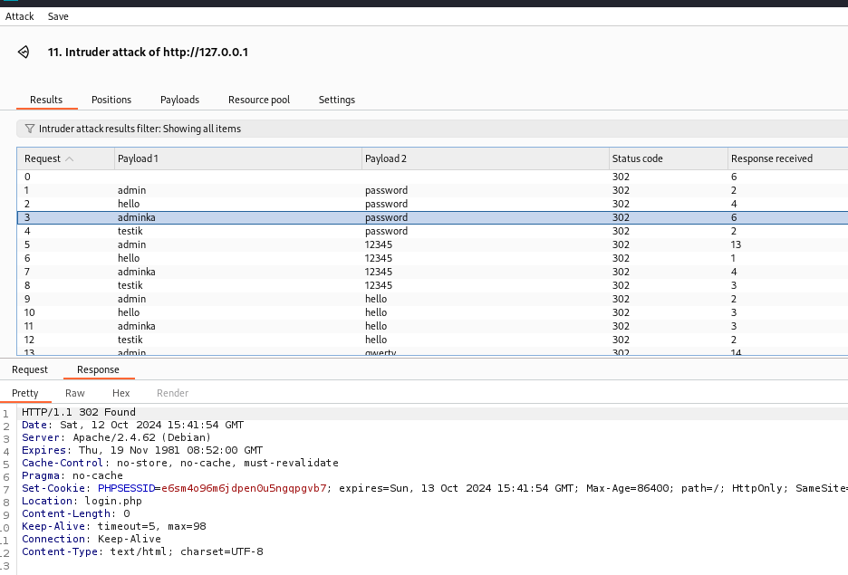{#fig:017 width=70%}

Посмотрим на ответ полученный с использованием правильных данных (admin, password). Увидим, что мы перешли на страницу DVWA index.php (рис. [-@fig:018]).

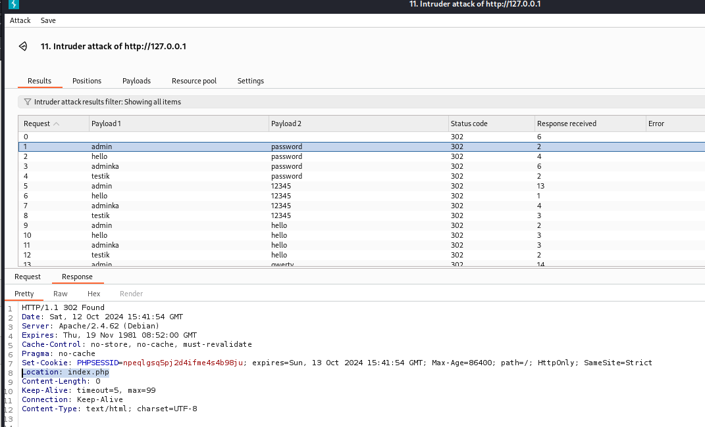{#fig:018 width=70%}

Также можем отправить результаты атаки к Repeater (рис. [-@fig:019]).

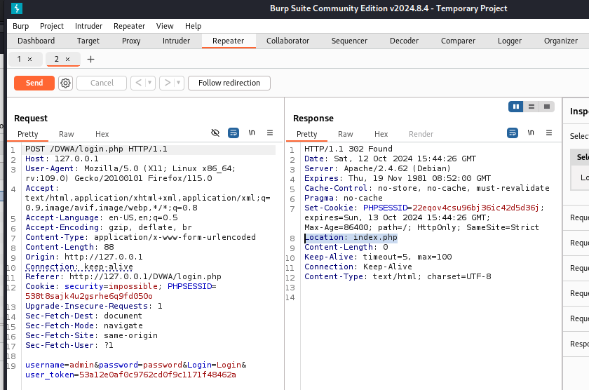{#fig:019 width=70%}

# Выводы

В результате выполнения данного этапа проекта я освоила навыки использования Burp Suite.

# Список литературы{.unnumbered}

::: {#refs}
:::
